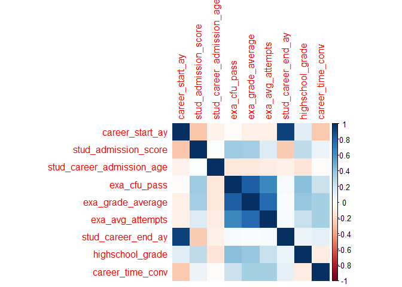
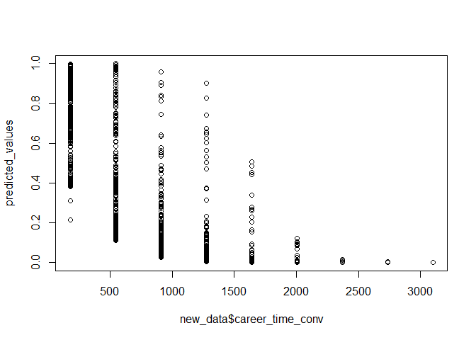

Progetto Inferenza Statistica
================
2024-05-15

## Librerie

``` r
library(readxl)
library(dplyr)
```

    ## 
    ## Attaching package: 'dplyr'

    ## The following objects are masked from 'package:stats':
    ## 
    ##     filter, lag

    ## The following objects are masked from 'package:base':
    ## 
    ##     intersect, setdiff, setequal, union

``` r
library( faraway )
library( leaps )
library(MASS)
```

    ## 
    ## Attaching package: 'MASS'

    ## The following object is masked from 'package:dplyr':
    ## 
    ##     select

``` r
library( GGally)
```

    ## Loading required package: ggplot2

    ## Registered S3 method overwritten by 'GGally':
    ##   method from   
    ##   +.gg   ggplot2

    ## 
    ## Attaching package: 'GGally'

    ## The following object is masked from 'package:faraway':
    ## 
    ##     happy

``` r
library(BAS)
library(rgl)
library(corrplot)
```

    ## corrplot 0.92 loaded

## Il Dataset

Prima di tutto definiamo la working directory:

`{setwd("C:/Users/alewi/Documents/University/HKUST & PoliMi/II Semestre/Inferenza Statistica/Progetto")}`

IMPORTANTE! Cambiare la directoy a seconda del pc.

Importiamo il Dataset, presente nella cartella `Dati/`:

``` r
setwd("C:/Users/alewi/Documents/University/HKUST & PoliMi/II Semestre/Inferenza Statistica/Progetto")
df <- read_excel("./Dati/Dropout20240226_IngMate.xlsx")
View(df)
```

## Regressione Logistica

Consideriamo innanzitutto solo gli studenti con carriere terminate, cioè
o che si sono laureati o che hanno abbandonato il corso di studio:

``` r
df$career_anonymous_id <- NULL
df$career_time <- NULL
df$stud_career_degree_start_id <- NULL

filtered_df <- df %>% filter(stud_career_status != 'A')
```

Selezioniamo dal dataset le variabili numeriche:

``` r
numerical_vars <- sapply(filtered_df, is.numeric)  # Find numeric columns
numerical_df <- filtered_df[, numerical_vars]  # Subset dataframe with numeric columns
```

Osserviamo se esistono correlazioni significative fra i dati numerici:

<!-- -->

Effettuiamo la regressione logistica fra le variabili numeriche del
dataset:

``` r
# Create a formula for linear model
formula <- as.formula(paste("dropout ~", paste(names(numerical_df[,-which(names(numerical_df) == "dropout")]), collapse = " + ")))

# Fit the linear model
model <- glm(formula, data = numerical_df)

# Print the summary of the model
summary(model)
```

    ## 
    ## Call:
    ## glm(formula = formula, data = numerical_df)
    ## 
    ## Deviance Residuals: 
    ##      Min        1Q    Median        3Q       Max  
    ## -0.62738  -0.11468  -0.03538   0.02774   1.59021  
    ## 
    ## Coefficients:
    ##                             Estimate Std. Error t value Pr(>|t|)    
    ## (Intercept)                1.195e+01  3.517e+00   3.398  0.00069 ***
    ## career_start_ay           -4.709e-02  1.882e-02  -2.502  0.01242 *  
    ## stud_admission_score       1.227e-03  5.485e-04   2.237  0.02540 *  
    ## stud_career_admission_age  2.064e-02  7.014e-03   2.942  0.00329 ** 
    ## exa_cfu_pass              -1.387e-02  8.810e-04 -15.747  < 2e-16 ***
    ## exa_grade_average         -7.660e-03  1.133e-03  -6.763 1.68e-11 ***
    ## exa_avg_attempts           2.072e-02  1.549e-02   1.338  0.18117    
    ## stud_career_end_ay         4.164e-02  1.865e-02   2.233  0.02567 *  
    ## highschool_grade          -3.702e-03  5.541e-04  -6.680 2.94e-11 ***
    ## career_time_conv          -5.418e-04  5.016e-05 -10.801  < 2e-16 ***
    ## ---
    ## Signif. codes:  0 '***' 0.001 '**' 0.01 '*' 0.05 '.' 0.1 ' ' 1
    ## 
    ## (Dispersion parameter for gaussian family taken to be 0.06033687)
    ## 
    ##     Null deviance: 420.48  on 2462  degrees of freedom
    ## Residual deviance: 148.01  on 2453  degrees of freedom
    ##   (79 observations deleted due to missingness)
    ## AIC: 86.03
    ## 
    ## Number of Fisher Scoring iterations: 2

Cerchiamo di trovare il miglior modello con un Automatic Selection
Method:

``` r
x = model.matrix( model ) [ , -1 ]
y = na.omit(numerical_df)$dropout

adjr = leaps( x, y, method = "adjr2" )
names(adjr)
```

    ## [1] "which" "label" "size"  "adjr2"

``` r
adjr
```

    ## $which
    ##       1     2     3     4     5     6     7     8     9
    ## 1 FALSE FALSE FALSE FALSE  TRUE FALSE FALSE FALSE FALSE
    ## 1 FALSE FALSE FALSE  TRUE FALSE FALSE FALSE FALSE FALSE
    ## 1 FALSE FALSE FALSE FALSE FALSE FALSE FALSE FALSE  TRUE
    ## 1 FALSE FALSE FALSE FALSE FALSE  TRUE FALSE FALSE FALSE
    ## 1 FALSE FALSE FALSE FALSE FALSE FALSE FALSE  TRUE FALSE
    ## 1 FALSE  TRUE FALSE FALSE FALSE FALSE FALSE FALSE FALSE
    ## 1 FALSE FALSE FALSE FALSE FALSE FALSE  TRUE FALSE FALSE
    ## 1 FALSE FALSE  TRUE FALSE FALSE FALSE FALSE FALSE FALSE
    ## 1  TRUE FALSE FALSE FALSE FALSE FALSE FALSE FALSE FALSE
    ## 2 FALSE FALSE FALSE  TRUE FALSE FALSE FALSE FALSE  TRUE
    ## 2 FALSE FALSE FALSE FALSE  TRUE FALSE FALSE FALSE  TRUE
    ## 2 FALSE FALSE FALSE FALSE FALSE  TRUE FALSE FALSE  TRUE
    ## 2 FALSE FALSE FALSE FALSE FALSE FALSE FALSE  TRUE  TRUE
    ## 2 FALSE FALSE FALSE  TRUE  TRUE FALSE FALSE FALSE FALSE
    ## 2 FALSE FALSE FALSE FALSE  TRUE FALSE  TRUE FALSE FALSE
    ## 2 FALSE FALSE  TRUE FALSE  TRUE FALSE FALSE FALSE FALSE
    ## 2 FALSE FALSE FALSE FALSE  TRUE  TRUE FALSE FALSE FALSE
    ## 2  TRUE FALSE FALSE FALSE  TRUE FALSE FALSE FALSE FALSE
    ## 2 FALSE  TRUE FALSE FALSE  TRUE FALSE FALSE FALSE FALSE
    ## 3 FALSE FALSE FALSE  TRUE FALSE FALSE FALSE  TRUE  TRUE
    ## 3 FALSE FALSE FALSE  TRUE  TRUE FALSE FALSE FALSE  TRUE
    ## 3  TRUE FALSE FALSE  TRUE FALSE FALSE FALSE FALSE  TRUE
    ## 3 FALSE FALSE  TRUE  TRUE FALSE FALSE FALSE FALSE  TRUE
    ## 3 FALSE FALSE FALSE  TRUE FALSE FALSE  TRUE FALSE  TRUE
    ## 3 FALSE FALSE FALSE  TRUE FALSE  TRUE FALSE FALSE  TRUE
    ## 3 FALSE  TRUE FALSE  TRUE FALSE FALSE FALSE FALSE  TRUE
    ## 3  TRUE FALSE FALSE  TRUE FALSE FALSE  TRUE FALSE FALSE
    ## 3 FALSE FALSE FALSE FALSE  TRUE FALSE FALSE  TRUE  TRUE
    ## 3  TRUE FALSE FALSE FALSE  TRUE FALSE FALSE FALSE  TRUE
    ## 4 FALSE FALSE FALSE  TRUE  TRUE FALSE FALSE  TRUE  TRUE
    ## 4  TRUE FALSE FALSE  TRUE  TRUE FALSE FALSE FALSE  TRUE
    ## 4 FALSE FALSE FALSE  TRUE  TRUE FALSE  TRUE FALSE  TRUE
    ## 4 FALSE FALSE  TRUE  TRUE  TRUE FALSE FALSE FALSE  TRUE
    ## 4  TRUE FALSE FALSE  TRUE FALSE FALSE FALSE  TRUE  TRUE
    ## 4 FALSE FALSE  TRUE  TRUE FALSE FALSE FALSE  TRUE  TRUE
    ## 4 FALSE FALSE FALSE  TRUE FALSE FALSE  TRUE  TRUE  TRUE
    ## 4 FALSE FALSE FALSE  TRUE FALSE  TRUE FALSE  TRUE  TRUE
    ## 4 FALSE  TRUE FALSE  TRUE FALSE FALSE FALSE  TRUE  TRUE
    ## 4 FALSE  TRUE FALSE  TRUE  TRUE FALSE FALSE FALSE  TRUE
    ## 5  TRUE FALSE FALSE  TRUE  TRUE FALSE FALSE  TRUE  TRUE
    ## 5 FALSE FALSE FALSE  TRUE  TRUE FALSE  TRUE  TRUE  TRUE
    ## 5 FALSE  TRUE FALSE  TRUE  TRUE FALSE FALSE  TRUE  TRUE
    ## 5 FALSE FALSE  TRUE  TRUE  TRUE FALSE FALSE  TRUE  TRUE
    ## 5 FALSE FALSE FALSE  TRUE  TRUE  TRUE FALSE  TRUE  TRUE
    ## 5  TRUE FALSE  TRUE  TRUE  TRUE FALSE FALSE FALSE  TRUE
    ## 5 FALSE FALSE  TRUE  TRUE  TRUE FALSE  TRUE FALSE  TRUE
    ## 5  TRUE FALSE FALSE  TRUE  TRUE FALSE  TRUE FALSE  TRUE
    ## 5  TRUE FALSE FALSE  TRUE  TRUE  TRUE FALSE FALSE  TRUE
    ## 5  TRUE FALSE  TRUE  TRUE FALSE FALSE FALSE  TRUE  TRUE
    ## 6  TRUE FALSE  TRUE  TRUE  TRUE FALSE FALSE  TRUE  TRUE
    ## 6 FALSE FALSE  TRUE  TRUE  TRUE FALSE  TRUE  TRUE  TRUE
    ## 6  TRUE FALSE FALSE  TRUE  TRUE FALSE  TRUE  TRUE  TRUE
    ## 6  TRUE  TRUE FALSE  TRUE  TRUE FALSE FALSE  TRUE  TRUE
    ## 6 FALSE  TRUE  TRUE  TRUE  TRUE FALSE FALSE  TRUE  TRUE
    ## 6 FALSE  TRUE FALSE  TRUE  TRUE FALSE  TRUE  TRUE  TRUE
    ## 6  TRUE FALSE FALSE  TRUE  TRUE  TRUE FALSE  TRUE  TRUE
    ## 6 FALSE FALSE FALSE  TRUE  TRUE  TRUE  TRUE  TRUE  TRUE
    ## 6 FALSE  TRUE FALSE  TRUE  TRUE  TRUE FALSE  TRUE  TRUE
    ## 6 FALSE FALSE  TRUE  TRUE  TRUE  TRUE FALSE  TRUE  TRUE
    ## 7  TRUE FALSE  TRUE  TRUE  TRUE FALSE  TRUE  TRUE  TRUE
    ## 7  TRUE  TRUE  TRUE  TRUE  TRUE FALSE FALSE  TRUE  TRUE
    ## 7 FALSE  TRUE  TRUE  TRUE  TRUE FALSE  TRUE  TRUE  TRUE
    ## 7  TRUE  TRUE FALSE  TRUE  TRUE FALSE  TRUE  TRUE  TRUE
    ## 7  TRUE FALSE  TRUE  TRUE  TRUE  TRUE FALSE  TRUE  TRUE
    ## 7 FALSE FALSE  TRUE  TRUE  TRUE  TRUE  TRUE  TRUE  TRUE
    ## 7  TRUE  TRUE FALSE  TRUE  TRUE  TRUE FALSE  TRUE  TRUE
    ## 7 FALSE  TRUE  TRUE  TRUE  TRUE  TRUE FALSE  TRUE  TRUE
    ## 7  TRUE FALSE FALSE  TRUE  TRUE  TRUE  TRUE  TRUE  TRUE
    ## 7 FALSE  TRUE FALSE  TRUE  TRUE  TRUE  TRUE  TRUE  TRUE
    ## 8  TRUE  TRUE  TRUE  TRUE  TRUE FALSE  TRUE  TRUE  TRUE
    ## 8  TRUE  TRUE  TRUE  TRUE  TRUE  TRUE FALSE  TRUE  TRUE
    ## 8  TRUE FALSE  TRUE  TRUE  TRUE  TRUE  TRUE  TRUE  TRUE
    ## 8 FALSE  TRUE  TRUE  TRUE  TRUE  TRUE  TRUE  TRUE  TRUE
    ## 8  TRUE  TRUE FALSE  TRUE  TRUE  TRUE  TRUE  TRUE  TRUE
    ## 8  TRUE  TRUE  TRUE  TRUE  TRUE  TRUE  TRUE FALSE  TRUE
    ## 8  TRUE  TRUE  TRUE  TRUE FALSE  TRUE  TRUE  TRUE  TRUE
    ## 8  TRUE  TRUE  TRUE  TRUE  TRUE  TRUE  TRUE  TRUE FALSE
    ## 8  TRUE  TRUE  TRUE FALSE  TRUE  TRUE  TRUE  TRUE  TRUE
    ## 9  TRUE  TRUE  TRUE  TRUE  TRUE  TRUE  TRUE  TRUE  TRUE
    ## 
    ## $label
    ##  [1] "(Intercept)" "1"           "2"           "3"           "4"          
    ##  [6] "5"           "6"           "7"           "8"           "9"          
    ## 
    ## $size
    ##  [1]  2  2  2  2  2  2  2  2  2  3  3  3  3  3  3  3  3  3  3  4  4  4  4  4  4
    ## [26]  4  4  4  4  5  5  5  5  5  5  5  5  5  5  6  6  6  6  6  6  6  6  6  6  7
    ## [51]  7  7  7  7  7  7  7  7  7  8  8  8  8  8  8  8  8  8  8  9  9  9  9  9  9
    ## [76]  9  9  9 10
    ## 
    ## $adjr2
    ##  [1] 0.422104795 0.392837693 0.364283432 0.282054119 0.065746633 0.041973576
    ##  [7] 0.016271900 0.014594418 0.007693593 0.624777845 0.589502237 0.485246417
    ## [13] 0.466039397 0.448092262 0.434852467 0.423635831 0.423464645 0.423192584
    ## [19] 0.422178908 0.634721345 0.634609934 0.627556262 0.627288938 0.627241440
    ## [25] 0.625995332 0.625045615 0.609428612 0.604110419 0.594395501 0.641986706
    ## [31] 0.637893973 0.637612232 0.636665343 0.636554382 0.636341919 0.636278188
    ## [37] 0.636026843 0.635751049 0.635396647 0.644311988 0.644049011 0.643559943
    ## [43] 0.643377944 0.641941869 0.639585137 0.639316871 0.638399692 0.638122393
    ## [49] 0.637963294 0.645476018 0.645225016 0.644996164 0.644920918 0.644745205
    ## [55] 0.644720259 0.644282093 0.644021189 0.643759698 0.643358642 0.646168603
    ## [61] 0.645988767 0.645795188 0.645522793 0.645470350 0.645221597 0.645052833
    ## [67] 0.644968786 0.644946638 0.644861938 0.646603813 0.646143808 0.646141229
    ## [73] 0.645960240 0.645615137 0.640436776 0.640276892 0.630065239 0.611161589
    ## [79] 0.646717404

``` r
bestmodel_adjr2_ind = which.max( adjr$adjr2 )
adjr$which[ bestmodel_adjr2_ind, ] 
```

    ##    1    2    3    4    5    6    7    8    9 
    ## TRUE TRUE TRUE TRUE TRUE TRUE TRUE TRUE TRUE

``` r
maxadjr(adjr,15 )
```

    ## 1,2,3,4,5,6,7,8,9   1,2,3,4,5,7,8,9     1,3,4,5,7,8,9   1,2,3,4,5,6,8,9 
    ##             0.647             0.647             0.646             0.646 
    ##   1,3,4,5,6,7,8,9     1,2,3,4,5,8,9   2,3,4,5,6,7,8,9     2,3,4,5,7,8,9 
    ##             0.646             0.646             0.646             0.646 
    ##   1,2,4,5,6,7,8,9     1,2,4,5,7,8,9       1,3,4,5,8,9     1,3,4,5,6,8,9 
    ##             0.646             0.646             0.645             0.645 
    ##       3,4,5,7,8,9     3,4,5,6,7,8,9     1,2,4,5,6,8,9 
    ##             0.645             0.645             0.645

Decidiamo di utilizzare il modello numero 11, dal momento che presenta 6
features, perdendo solamente 0.002 di adjr2 rispetto al caso ottimale.

Il modello diventa dunque:

``` r
# Assuming 'df' is your dataframe and 'target' is your target variable
# Select only the columns you're interested in
selected_df <- numerical_df[, c(1,3,4,5,6,9,10)]

# Create a formula for the model
# This assumes that the first column is the target variable
formula <- as.formula(paste("dropout ~", paste(names(selected_df[,-which(names(selected_df) == "dropout")]), collapse = " + ")))

# Fit the model
model_opt <- glm(formula, data = selected_df, family = binomial)

# Print the summary of the model
summary(model_opt)
```

    ## 
    ## Call:
    ## glm(formula = formula, family = binomial, data = selected_df)
    ## 
    ## Deviance Residuals: 
    ##     Min       1Q   Median       3Q      Max  
    ## -1.8733  -0.3005  -0.2056  -0.0921   4.6997  
    ## 
    ## Coefficients:
    ##                             Estimate Std. Error z value Pr(>|z|)    
    ## (Intercept)                1.308e+02  6.140e+01   2.130  0.03317 *  
    ## career_start_ay           -6.350e-02  3.026e-02  -2.098  0.03586 *  
    ## stud_career_admission_age  3.864e-01  1.428e-01   2.706  0.00682 ** 
    ## exa_cfu_pass              -1.320e-01  1.467e-02  -8.992  < 2e-16 ***
    ## exa_grade_average         -3.883e-02  1.396e-02  -2.782  0.00541 ** 
    ## highschool_grade          -4.226e-02  8.967e-03  -4.713 2.44e-06 ***
    ## career_time_conv          -4.514e-03  2.656e-04 -16.996  < 2e-16 ***
    ## ---
    ## Signif. codes:  0 '***' 0.001 '**' 0.01 '*' 0.05 '.' 0.1 ' ' 1
    ## 
    ## (Dispersion parameter for binomial family taken to be 1)
    ## 
    ##     Null deviance: 2585.74  on 2462  degrees of freedom
    ## Residual deviance:  914.23  on 2456  degrees of freedom
    ##   (79 observations deleted due to missingness)
    ## AIC: 928.23
    ## 
    ## Number of Fisher Scoring iterations: 6

Applichiamo adesso il modello lineare sugli studenti che non hanno
ancora completato il loro percorso universitario:

``` r
new_data = filtered_df <- df %>% filter(stud_career_status == 'A')
new_data_vars <- sapply(new_data, is.numeric)  # Find numeric columns
new_data <- new_data[, numerical_vars]  # Subset dataframe with numeric columns
new_data = new_data[,c(-4,-8)]
new_data = na.omit(new_data)

View(new_data)

predicted_values <- predict(model_opt, newdata = new_data, type = "response")
plot(new_data$career_time_conv, predicted_values)
```

<!-- -->
