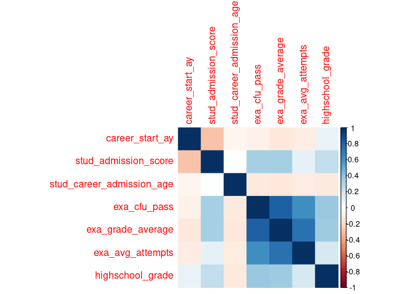
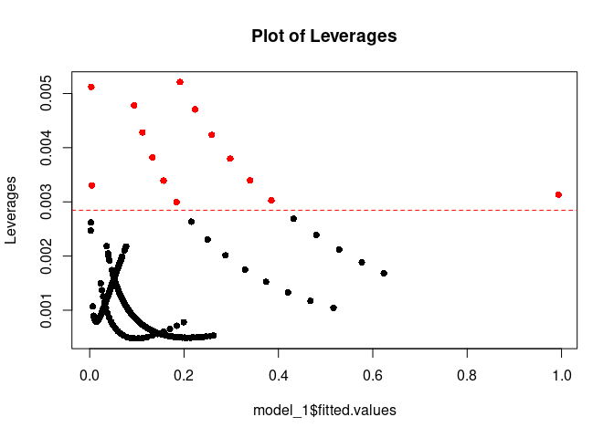
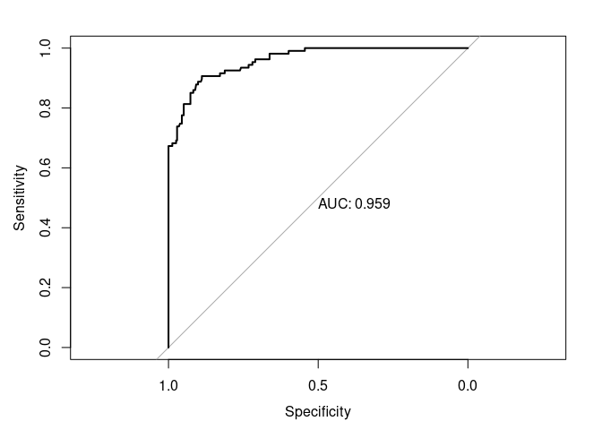

Regressione Logistica Senza Parametro Temporale
================
Alessandro Wiget, Sofia Sannino, Pietro Masini, Giulia Riccardi
2024-05-21

## Librerie

``` r
library(readxl)
library(dplyr)
library( faraway )
library( leaps )
library(MASS)
library( GGally)
library(BAS)
library(rgl)
library(corrplot)
library(pscl)
library(plm)
#library(glmulti)
library(AICcmodavg)
#library(glmtoolbox)
library(caret)
library(pROC)
library(e1071)
library(stats)
```

## Il Dataset

Prima di tutto definiamo la working directory:

IMPORTANTE! Cambiare la directoy a seconda del pc.

Importiamo il Dataset, presente nella cartella `Dati/`:

``` r
setwd("/home/alessandro/Inferenza Statistica/Progetto/Code/")
df <- read_excel("../Dati/Dropout20240226_IngMate.xlsx")
#View(df)
```

## Regressione Logistica

Consideriamo innanzitutto solo gli studenti con carriere terminate, cioè
o che si sono laureati o che hanno abbandonato il corso di studio:

``` r
df$career_anonymous_id <- NULL
df$career_time <- NULL
df$stud_career_degree_start_id <- NULL
df$stud_career_degree_changed <- NULL
df$stud_career_degree_name <- NULL
df$stud_ofa_flst <- NULL
df$stud_ofa_fltp <- NULL
df$stud_career_degree_area <- NULL
df$stud_career_degree_code <- NULL
df$stud_career_degree_code_CdS <-NULL
df$highschool_type <- NULL
df$highschool_type_code <- NULL #abbiamo cancellato queste variabili operche possiamo separare fra classico, scientifico e altro con un'altra variabile
df$stud_admis_convent_start_dt <- NULL
df$stud_career_end_ay <-NULL

filtered_df <- df %>% filter(stud_career_status != 'A')
```

Selezioniamo dal dataset le variabili numeriche:

``` r
numerical_vars <- sapply(filtered_df, is.numeric)  # Find numeric columns
numerical_df <- filtered_df[, numerical_vars]  # Subset dataframe with numeric columns
numerical_df = na.omit(numerical_df)

numerical_df = numerical_df[which(!((numerical_df$career_time_conv > 1000 & numerical_df$exa_cfu_pass==0)| numerical_df$career_time_conv<0 | numerical_df$career_time_conv>1600)),]
numerical_df$career_time_conv <- NULL

View(numerical_df)
```

Osserviamo se esistono correlazioni significative fra i dati numerici:

``` r
X = numerical_df[, -4]
corrplot(cor(X), method='color')
```

<!-- -->

## La Prima Regressione Logistica

Effettuiamo la regressione logistica fra le variabili numeriche del
dataset, e vediamo quanto vale inizialmente l’adjustedR2:

``` r
# Create a formula for linear model
formula_num <- as.formula(paste("dropout ~", paste(names(numerical_df[,-which(names(numerical_df) == "dropout")]), collapse = " + ")))

# Fit the linear model
model_init <- glm(formula_num, data = numerical_df, family=binomial)

# Print the summary of the model
summary(model_init)
```

    ## 
    ## Call:
    ## glm(formula = formula_num, family = binomial, data = numerical_df)
    ## 
    ## Deviance Residuals: 
    ##     Min       1Q   Median       3Q      Max  
    ## -1.4389  -0.3475  -0.1976  -0.1373   3.4572  
    ## 
    ## Coefficients:
    ##                             Estimate Std. Error z value Pr(>|z|)    
    ## (Intercept)               -21.630318  64.090364  -0.337    0.736    
    ## career_start_ay             0.012040   0.031521   0.382    0.702    
    ## stud_admission_score        0.006270   0.009871   0.635    0.525    
    ## stud_career_admission_age   0.167368   0.149626   1.119    0.263    
    ## exa_cfu_pass               -0.143545   0.013888 -10.336  < 2e-16 ***
    ## exa_grade_average          -0.190636   0.024818  -7.681 1.57e-14 ***
    ## exa_avg_attempts           -0.189713   0.235120  -0.807    0.420    
    ## highschool_grade           -0.012120   0.009129  -1.328    0.184    
    ## ---
    ## Signif. codes:  0 '***' 0.001 '**' 0.01 '*' 0.05 '.' 0.1 ' ' 1
    ## 
    ## (Dispersion parameter for binomial family taken to be 1)
    ## 
    ##     Null deviance: 2211.89  on 2107  degrees of freedom
    ## Residual deviance:  878.74  on 2100  degrees of freedom
    ## AIC: 894.74
    ## 
    ## Number of Fisher Scoring iterations: 7

``` r
pseudo_r2 <- pR2(model_init)
```

    ## fitting null model for pseudo-r2

``` r
pseudo_r2['McFadden']
```

    ##  McFadden 
    ## 0.6027171

Iniziamo da un valore di adjustedR2 di 0.656, quindi già buono, vediamo
adesso di trovare un buon modello logistico, che dunque minimizzi l’AIC.

Restringiamoci al miglior modello per ogni numero di variabli
(l’intercetta conta come variabile extra), e mostriamo anche i
rispettivi adjustedR2:

Non notiamo un peggioramento troppo elevato né dell’AIC né dell’adjR2
utilizzando il modello a 5 covariate, quindi prendiamo in considerazione
quest’ultimo.

Effettuiamo una ricerca backward dal modello finale per cercare di
trovare un modello simile ma con un processo più logico.

``` r
covariate = paste("dropout ~", paste(names(numerical_df[,-which(names(numerical_df) == "dropout")]), collapse = " + "))

#Covariate rimosse durante la semplificazione, in ordine

formula_num <- as.formula(covariate)

# Fit the linear model
model_back <- glm(formula_num, data = numerical_df, family=binomial)

# Print the summary of the model
drop1(model_back, test="Chisq")
```

    ## Single term deletions
    ## 
    ## Model:
    ## dropout ~ career_start_ay + stud_admission_score + stud_career_admission_age + 
    ##     exa_cfu_pass + exa_grade_average + exa_avg_attempts + highschool_grade
    ##                           Df Deviance     AIC     LRT Pr(>Chi)    
    ## <none>                         878.74  894.74                     
    ## career_start_ay            1   878.89  892.89   0.146   0.7021    
    ## stud_admission_score       1   879.15  893.15   0.404   0.5252    
    ## stud_career_admission_age  1   880.02  894.02   1.276   0.2586    
    ## exa_cfu_pass               1   998.63 1012.63 119.883   <2e-16 ***
    ## exa_grade_average          1   970.21  984.21  91.465   <2e-16 ***
    ## exa_avg_attempts           1   879.41  893.41   0.661   0.4162    
    ## highschool_grade           1   880.49  894.49   1.743   0.1868    
    ## ---
    ## Signif. codes:  0 '***' 0.001 '**' 0.01 '*' 0.05 '.' 0.1 ' ' 1

``` r
#-----------------------------
model_back = update(model_back, . ~ . - career_start_ay)

# Print the summary of the model
drop1(model_back, test="Chisq")
```

    ## Single term deletions
    ## 
    ## Model:
    ## dropout ~ stud_admission_score + stud_career_admission_age + 
    ##     exa_cfu_pass + exa_grade_average + exa_avg_attempts + highschool_grade
    ##                           Df Deviance     AIC     LRT Pr(>Chi)    
    ## <none>                         878.89  892.89                     
    ## stud_admission_score       1   879.20  891.20   0.306   0.5801    
    ## stud_career_admission_age  1   880.09  892.09   1.196   0.2740    
    ## exa_cfu_pass               1   998.74 1010.74 119.847   <2e-16 ***
    ## exa_grade_average          1   972.32  984.32  93.432   <2e-16 ***
    ## exa_avg_attempts           1   879.56  891.56   0.672   0.4124    
    ## highschool_grade           1   880.57  892.57   1.675   0.1956    
    ## ---
    ## Signif. codes:  0 '***' 0.001 '**' 0.01 '*' 0.05 '.' 0.1 ' ' 1

``` r
#-------------------------------
model_back = update(model_back, . ~ . - stud_admission_score)

# Print the summary of the model
drop1(model_back, test="Chisq")
```

    ## Single term deletions
    ## 
    ## Model:
    ## dropout ~ stud_career_admission_age + exa_cfu_pass + exa_grade_average + 
    ##     exa_avg_attempts + highschool_grade
    ##                           Df Deviance     AIC     LRT Pr(>Chi)    
    ## <none>                         879.20  891.20                     
    ## stud_career_admission_age  1   880.40  890.40   1.201   0.2732    
    ## exa_cfu_pass               1   999.55 1009.55 120.357   <2e-16 ***
    ## exa_grade_average          1   973.03  983.03  93.834   <2e-16 ***
    ## exa_avg_attempts           1   879.91  889.91   0.716   0.3973    
    ## highschool_grade           1   880.85  890.85   1.656   0.1981    
    ## ---
    ## Signif. codes:  0 '***' 0.001 '**' 0.01 '*' 0.05 '.' 0.1 ' ' 1

``` r
#-------------------------------
model_back = update(model_back, . ~ . - exa_avg_attempts)

# Print the summary of the model
drop1(model_back, test="Chisq")
```

    ## Single term deletions
    ## 
    ## Model:
    ## dropout ~ stud_career_admission_age + exa_cfu_pass + exa_grade_average + 
    ##     highschool_grade
    ##                           Df Deviance     AIC     LRT Pr(>Chi)    
    ## <none>                         879.91  889.91                     
    ## stud_career_admission_age  1   881.21  889.21   1.294   0.2554    
    ## exa_cfu_pass               1  1001.42 1009.42 121.506   <2e-16 ***
    ## exa_grade_average          1  1001.44 1009.44 121.527   <2e-16 ***
    ## highschool_grade           1   881.44  889.44   1.521   0.2174    
    ## ---
    ## Signif. codes:  0 '***' 0.001 '**' 0.01 '*' 0.05 '.' 0.1 ' ' 1

``` r
#-------------------------------
model_back = update(model_back, . ~ . - stud_career_admission_age)

# Print the summary of the model
drop1(model_back, test="Chisq")
```

    ## Single term deletions
    ## 
    ## Model:
    ## dropout ~ exa_cfu_pass + exa_grade_average + highschool_grade
    ##                   Df Deviance     AIC     LRT Pr(>Chi)    
    ## <none>                 881.21  889.21                     
    ## exa_cfu_pass       1  1003.38 1009.38 122.173   <2e-16 ***
    ## exa_grade_average  1  1003.15 1009.15 121.939   <2e-16 ***
    ## highschool_grade   1   882.87  888.87   1.658   0.1979    
    ## ---
    ## Signif. codes:  0 '***' 0.001 '**' 0.01 '*' 0.05 '.' 0.1 ' ' 1

``` r
#-------------------------------
model_back = update(model_back, . ~ . - highschool_grade)

# Print the summary of the model
drop1(model_back, test="Chisq")
```

    ## Single term deletions
    ## 
    ## Model:
    ## dropout ~ exa_cfu_pass + exa_grade_average
    ##                   Df Deviance     AIC    LRT  Pr(>Chi)    
    ## <none>                 882.87  888.87                     
    ## exa_cfu_pass       1  1012.94 1016.94 130.08 < 2.2e-16 ***
    ## exa_grade_average  1  1007.99 1011.99 125.12 < 2.2e-16 ***
    ## ---
    ## Signif. codes:  0 '***' 0.001 '**' 0.01 '*' 0.05 '.' 0.1 ' ' 1

``` r
#-------------------------------

summary(model_back)
```

    ## 
    ## Call:
    ## glm(formula = dropout ~ exa_cfu_pass + exa_grade_average, family = binomial, 
    ##     data = numerical_df)
    ## 
    ## Deviance Residuals: 
    ##     Min       1Q   Median       3Q      Max  
    ## -1.3976  -0.3466  -0.1986  -0.1364   3.5224  
    ## 
    ## Coefficients:
    ##                   Estimate Std. Error z value Pr(>|z|)    
    ## (Intercept)        5.02456    0.49156  10.222   <2e-16 ***
    ## exa_cfu_pass      -0.14573    0.01353 -10.768   <2e-16 ***
    ## exa_grade_average -0.19447    0.02343  -8.301   <2e-16 ***
    ## ---
    ## Signif. codes:  0 '***' 0.001 '**' 0.01 '*' 0.05 '.' 0.1 ' ' 1
    ## 
    ## (Dispersion parameter for binomial family taken to be 1)
    ## 
    ##     Null deviance: 2211.89  on 2107  degrees of freedom
    ## Residual deviance:  882.87  on 2105  degrees of freedom
    ## AIC: 888.87
    ## 
    ## Number of Fisher Scoring iterations: 7

Aggiungere che teniamo il modello con 5 covariate, rifiutando il modello
con 4 per via del tenst sulle devianze.

## Analisi dei Punti Influenti

Valutiamo l’impatto sul modello di eventuali punti leva e outliers.
Partiamo dai punti leva:

``` r
model_1=model_back
Z=model.matrix(model_1) #matrice disegno, i leverages su diag princ
# __Rule of thumb:__ Given a point h_ii diagonal element of H, the i-th observation is a leverage if:
#  h_ii > 2*(p)/n
lev=hat(Z) #h_ii
p = model_1$rank #nro covariate+1  
n = dim(Z)[1] #nro osservazioni

#plot dei leverages in funzione dell'osservazione
plot(model_1$fitted.values, lev, ylab = "Leverages", main = "Plot of Leverages", 
      pch = 16, col = 'black' )
abline( h = 2 * p/n, lty = 2, col = 'red' ) #COSTRUISCO LEVA PER VEDERE SE QUALCUNO SUPERA
watchout_points_lev = lev[ which( lev > 2 * p/n  ) ]
watchout_ids_lev = seq_along( lev )[ which( lev > 2 * p/n ) ] ## identify the rows relative to leverage points
points( model_1$fitted.values[ watchout_ids_lev ], watchout_points_lev, col = 'red', pch = 16 )
```

<!-- -->

``` r
sum( lev [ lev >  2 * p / n ] ) # 1.36234/5= 0.272468 i leverages pesano quasi il 30 percento
```

    ## [1] 1.260312

## Introduzione Interazioni fra Variabili Numeriche

Prima di procedere con l’aggiunta di variabili categoriche cerchiamo di
comprendere se le aggiunte di interazioni fra variabili numeriche ci
permettono di migliorare il nostro modello. Osservando la matrice delle
covariate costruita all’inizio possiamo osservare che `career_start_ay`
e `stud_career_end_ay` sono estremamente correlate, aggiungiamo quindi
al modello: `career_start_ay*stud_career_end_ay`. Seguendo lo stesso
ragionamento un’altra coppia di covariate che appaiono essere molto
correlate sono `exa_cfu_pass` e `exa_grade_average`, introduciamo la
loro interazione `exa_cfu_pass*exa_grade_average`:

``` r
model_int_grade = update(model_back, . ~ . + exa_cfu_pass*exa_grade_average)

#gvif(model_1)
#gvif(model_int_grade)

anova(model_1, model_int_grade, test="Chisq")
```

    ## Analysis of Deviance Table
    ## 
    ## Model 1: dropout ~ exa_cfu_pass + exa_grade_average
    ## Model 2: dropout ~ exa_cfu_pass + exa_grade_average + exa_cfu_pass:exa_grade_average
    ##   Resid. Df Resid. Dev Df Deviance Pr(>Chi)
    ## 1      2105     882.87                     
    ## 2      2104     882.54  1  0.32623   0.5679

Non accetto il nuovo modello con l’interazione poichè il GVIF è troppo
elevato.

## Introduzione delle Variabili Categoriche

Rendiamo tutte le variabili del Dataset di tipo `factor` affinchè siano
utilizzabili nella regressione logistica.

``` r
MODEL = model_1

filtered_df <- df %>% filter(stud_career_status != 'A')
filtered_df_no_na = na.omit(filtered_df)

#Partendo dal modello di ottimo trovato prima costruisco la matrice solo con quelle covariate:
cat_df <- filtered_df_no_na

cat_no_lev_df = cat_df[which(!((cat_df$career_time_conv > 1000 & cat_df$exa_cfu_pass==0)| cat_df$career_time_conv<0 | cat_df$career_time_conv>1600)),]
cat_no_lev_df$career_time_conv <- NULL

cat_no_lev_df$stud_gender = factor(cat_no_lev_df$stud_gender, ordered=F)
cat_no_lev_df$previousStudies = factor(cat_no_lev_df$previousStudies, ordered=F)
cat_no_lev_df$origins = factor(cat_no_lev_df$origins, ordered=F)
cat_no_lev_df$income_bracket_normalized_on4 = factor(cat_no_lev_df$income_bracket_normalized_on4, ordered=F)


cat_no_lev_df$dropped_on_180<-NULL
cat_no_lev_df$stud_career_status <-NULL


View(cat_no_lev_df)
```

``` r
male = cat_no_lev_df[which(cat_no_lev_df$stud_gender=="M"),]
male_mean = mean(male$dropout)
male_mean
```

    ## [1] 0.2138554

``` r
female = cat_no_lev_df[which(cat_no_lev_df$stud_gender=="F"),]
female_mean = mean(female$dropout)
female_mean
```

    ## [1] 0.225641

``` r
# Facciamo uno z-test con:
#                       H0: pM == pF
#                       H1: pM != pF

p_hat = (sum(female$dropout) + sum(male$dropout))/(nrow(cat_no_lev_df))

z_test = (male_mean - female_mean)/sqrt(p_hat*(1-p_hat)*(1/nrow(male) + 1/nrow(female)))

p_value = 2*pnorm(z_test)
p_value
```

    ## [1] 0.5270455

Non posso rifiutare H0. Non noto una differenza di probabilità di
dropout fra maschi e femmine. Non aggiungiamo questa categoria nel
modello finale.

``` r
model_cat = glm("dropout ~ 1 + 
    exa_cfu_pass + exa_grade_average + stud_gender + previousStudies + origins + income_bracket_normalized_on4", data=cat_no_lev_df, family=binomial)

drop1(model_cat, test="Chisq")
```

    ## Single term deletions
    ## 
    ## Model:
    ## dropout ~ 1 + exa_cfu_pass + exa_grade_average + stud_gender + 
    ##     previousStudies + origins + income_bracket_normalized_on4
    ##                               Df Deviance     AIC     LRT  Pr(>Chi)    
    ## <none>                             858.36  884.36                      
    ## exa_cfu_pass                   1   982.50 1006.50 124.139 < 2.2e-16 ***
    ## exa_grade_average              1   988.36 1012.36 130.003 < 2.2e-16 ***
    ## stud_gender                    1   862.56  886.56   4.199  0.040458 *  
    ## previousStudies                3   869.91  889.91  11.552  0.009089 ** 
    ## origins                        3   860.32  880.32   1.961  0.580636    
    ## income_bracket_normalized_on4  3   865.36  885.36   7.002  0.071841 .  
    ## ---
    ## Signif. codes:  0 '***' 0.001 '**' 0.01 '*' 0.05 '.' 0.1 ' ' 1

``` r
model_cat = update(model_cat,  . ~ . - origins)
drop1(model_cat, test="Chisq")
```

    ## Single term deletions
    ## 
    ## Model:
    ## dropout ~ exa_cfu_pass + exa_grade_average + stud_gender + previousStudies + 
    ##     income_bracket_normalized_on4
    ##                               Df Deviance     AIC     LRT  Pr(>Chi)    
    ## <none>                             860.32  880.32                      
    ## exa_cfu_pass                   1   983.33 1001.33 123.010 < 2.2e-16 ***
    ## exa_grade_average              1   991.27 1009.27 130.949 < 2.2e-16 ***
    ## stud_gender                    1   864.69  882.69   4.373  0.036512 *  
    ## previousStudies                3   872.05  886.05  11.729  0.008371 ** 
    ## income_bracket_normalized_on4  3   867.47  881.47   7.147  0.067347 .  
    ## ---
    ## Signif. codes:  0 '***' 0.001 '**' 0.01 '*' 0.05 '.' 0.1 ' ' 1

``` r
model_cat = update(model_cat,  . ~ . - income_bracket_normalized_on4)
drop1(model_cat, test="Chisq")
```

    ## Single term deletions
    ## 
    ## Model:
    ## dropout ~ exa_cfu_pass + exa_grade_average + stud_gender + previousStudies
    ##                   Df Deviance     AIC     LRT Pr(>Chi)    
    ## <none>                 867.47  881.47                     
    ## exa_cfu_pass       1   991.06 1003.06 123.588  < 2e-16 ***
    ## exa_grade_average  1   996.66 1008.66 129.188  < 2e-16 ***
    ## stud_gender        1   871.74  883.74   4.267  0.03886 *  
    ## previousStudies    3   878.42  886.42  10.951  0.01199 *  
    ## ---
    ## Signif. codes:  0 '***' 0.001 '**' 0.01 '*' 0.05 '.' 0.1 ' ' 1

Abbiamo trovato che il modello ha bisogno di covariate categoriche,
ovvero: stud_gender e previousStudies, forse.

## Confusion Matrix

``` r
# Assume you have a dataframe data with predictors and a response variable
# split the data into train and test
set.seed(123)
trainIndex <- createDataPartition(cat_no_lev_df$dropout, p = 0.8, 
                                  list = FALSE, 
                                  times = 1)

train <- cat_no_lev_df[ trainIndex,]
test  <- cat_no_lev_df[-trainIndex,]

# Fit the logistic regression model
fit <- glm("dropout ~ 1 + exa_cfu_pass + exa_grade_average + previousStudies + origins", data = train, family = binomial)

# Make predictions on the test set
predicted_probs <- predict(fit, newdata = test, type = "response")
#

# Compute the confusion matrix
#predicted_classes <- ifelse(predicted_probs > 0.5, 1, 0)
#cm <- confusionMatrix(predicted_classes, test$response)
#print(cm)

# Compute the ROC curve
roc_obj <- roc(test$dropout, predicted_probs)
```

    ## Setting levels: control = 0, case = 1

    ## Setting direction: controls < cases

``` r
# Plot the ROC curve
plot(roc_obj, print.auc = TRUE)
```

<!-- -->

``` r
# Compute the AUC
auc <- auc(roc_obj)
print(auc)
```

    ## Area under the curve: 0.9578

``` r
#trovare soglia opt
best=coords(roc_obj, "best", ret="threshold", best.method="youden")
print(best)
```

    ##   threshold
    ## 1 0.3265654

``` r
#
test$dropout=as.factor(test$dropout)

# Compute the confusion matrix
predicted_classes <- ifelse(predicted_probs > 0.1915817, 1, 0)
predicted_classes=as.factor(predicted_classes)

cm <- confusionMatrix(predicted_classes, test$dropout)
print(cm)
```

    ## Confusion Matrix and Statistics
    ## 
    ##           Reference
    ## Prediction   0   1
    ##          0 277  11
    ##          1  37  96
    ##                                           
    ##                Accuracy : 0.886           
    ##                  95% CI : (0.8517, 0.9147)
    ##     No Information Rate : 0.7458          
    ##     P-Value [Acc > NIR] : 6.393e-13       
    ##                                           
    ##                   Kappa : 0.7216          
    ##                                           
    ##  Mcnemar's Test P-Value : 0.000308        
    ##                                           
    ##             Sensitivity : 0.8822          
    ##             Specificity : 0.8972          
    ##          Pos Pred Value : 0.9618          
    ##          Neg Pred Value : 0.7218          
    ##              Prevalence : 0.7458          
    ##          Detection Rate : 0.6580          
    ##    Detection Prevalence : 0.6841          
    ##       Balanced Accuracy : 0.8897          
    ##                                           
    ##        'Positive' Class : 0               
    ## 

## Predizione sugli studenti in corso:

Costruiamo il dataset degli studenti ancora non laureati o che hanno
abbandonato:

``` r
attivi_df <- df %>% filter(stud_career_status == 'A')
attivi_df$dropout <- NULL

attivi_df$stud_career_end_date <- NULL
attivi_df = na.omit(attivi_df)
attivi_df = attivi_df[which(!((attivi_df$career_time_conv > 1000 & attivi_df$exa_cfu_pass==0) | attivi_df$career_start_ay!=2023 | attivi_df$career_time_conv<177)),]

attivi_df$stud_gender = factor(attivi_df$stud_gender, ordered=F)
attivi_df$previousStudies = factor(attivi_df$previousStudies, ordered=F)

View(attivi_df)
```

Il modello ottimale è il seguente:

``` r
model_opt = glm("dropout ~ 1 + exa_cfu_pass + exa_grade_average + previousStudies + origins", data = train, family=binomial)
summary(model_opt)
```

    ## 
    ## Call:
    ## glm(formula = "dropout ~ 1 + exa_cfu_pass + exa_grade_average + previousStudies + origins", 
    ##     family = binomial, data = train)
    ## 
    ## Deviance Residuals: 
    ##     Min       1Q   Median       3Q      Max  
    ## -1.7083  -0.3529  -0.1989  -0.1375   3.5361  
    ## 
    ## Coefficients:
    ##                            Estimate Std. Error z value Pr(>|z|)    
    ## (Intercept)                 4.69310    0.62727   7.482 7.33e-14 ***
    ## exa_cfu_pass               -0.14763    0.01537  -9.602  < 2e-16 ***
    ## exa_grade_average          -0.18252    0.02502  -7.295 2.99e-13 ***
    ## previousStudiesOthers       0.74299    0.72630   1.023   0.3063    
    ## previousStudiesScientifica  0.07735    0.37523   0.206   0.8367    
    ## previousStudiesTecnica      1.26316    0.56944   2.218   0.0265 *  
    ## originsForeigner           -0.13420    1.25465  -0.107   0.9148    
    ## originsMilanese            -0.08291    0.23300  -0.356   0.7220    
    ## originsOffsite             -0.57919    0.51246  -1.130   0.2584    
    ## ---
    ## Signif. codes:  0 '***' 0.001 '**' 0.01 '*' 0.05 '.' 0.1 ' ' 1
    ## 
    ## (Dispersion parameter for binomial family taken to be 1)
    ## 
    ##     Null deviance: 1730.72  on 1686  degrees of freedom
    ## Residual deviance:  702.44  on 1678  degrees of freedom
    ## AIC: 720.44
    ## 
    ## Number of Fisher Scoring iterations: 7

Costruiamo la predizione per gli attivi:

``` r
predizione <- predict(model_opt, newdata = attivi_df, type = "response")

binary_output <- ifelse(predizione > 0.5, 1, 0)

attivi_df$dropout_prediction = binary_output

sum(binary_output)/length(binary_output)
```

    ## [1] 0.2

``` r
View(attivi_df)
```
