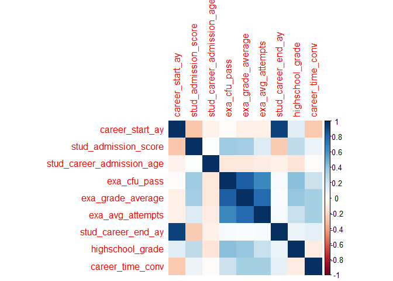
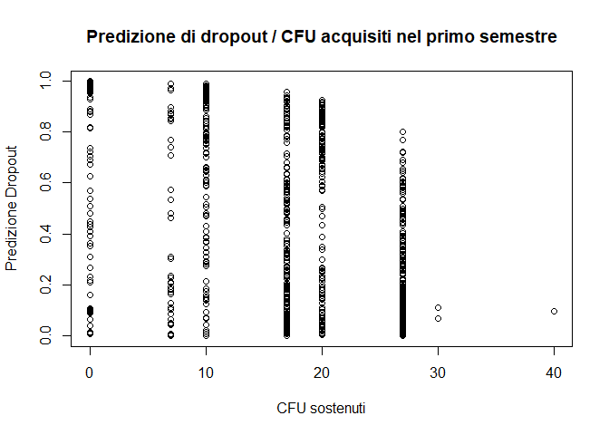
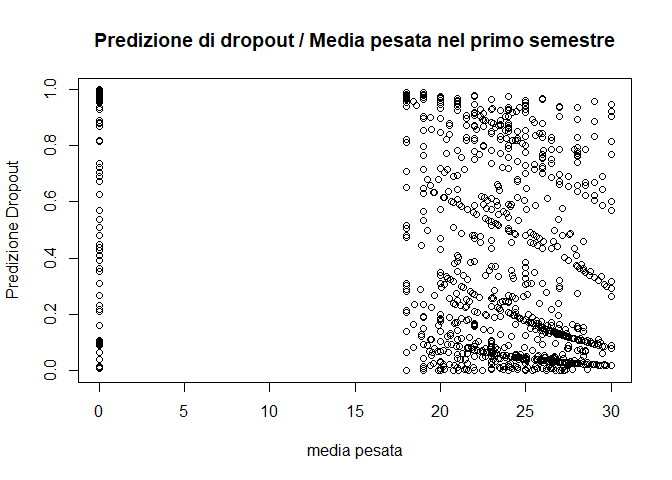

Regressione Logistica
================
Alessandro Wiget
2024-05-15

## Librerie

``` r
library(readxl)
library(dplyr)
library( faraway )
library( leaps )
library(MASS)
library( GGally)
library(BAS)
library(rgl)
library(corrplot)
library(pscl)
```

## Il Dataset

Prima di tutto definiamo la working directory:

IMPORTANTE! Cambiare la directoy a seconda del pc.

Importiamo il Dataset, presente nella cartella `Dati/`:

``` r
setwd("C:/Users/alewi/Documents/University/HKUST & PoliMi/II Semestre/Inferenza Statistica/Progetto")
df <- read_excel("./Dati/Dropout20240226_IngMate.xlsx")
#View(df)
```

## Regressione Logistica

Consideriamo innanzitutto solo gli studenti con carriere terminate, cioè
o che si sono laureati o che hanno abbandonato il corso di studio:

``` r
df$career_anonymous_id <- NULL
df$career_time <- NULL
df$stud_career_degree_start_id <- NULL

filtered_df <- df %>% filter(stud_career_status != 'A')
```

Selezioniamo dal dataset le variabili numeriche:

``` r
numerical_vars <- sapply(filtered_df, is.numeric)  # Find numeric columns
numerical_df <- filtered_df[, numerical_vars]  # Subset dataframe with numeric columns
numerical_df = na.omit(numerical_df)
```

Osserviamo se esistono correlazioni significative fra i dati numerici:

``` r
X = numerical_df[, -4]
corrplot(cor(X), method='color')
```

<!-- -->

Effettuiamo la regressione logistica fra le variabili numeriche del
dataset:

``` r
# Create a formula for linear model
formula <- as.formula(paste("dropout ~", paste(names(numerical_df[,-which(names(numerical_df) == "dropout")]), collapse = " + ")))

# Fit the linear model
model <- glm(formula, data = numerical_df)

# Print the summary of the model
summary(model)
```

    ## 
    ## Call:
    ## glm(formula = formula, data = numerical_df)
    ## 
    ## Deviance Residuals: 
    ##      Min        1Q    Median        3Q       Max  
    ## -0.62738  -0.11468  -0.03538   0.02774   1.59021  
    ## 
    ## Coefficients:
    ##                             Estimate Std. Error t value Pr(>|t|)    
    ## (Intercept)                1.195e+01  3.517e+00   3.398  0.00069 ***
    ## career_start_ay           -4.709e-02  1.882e-02  -2.502  0.01242 *  
    ## stud_admission_score       1.227e-03  5.485e-04   2.237  0.02540 *  
    ## stud_career_admission_age  2.064e-02  7.014e-03   2.942  0.00329 ** 
    ## exa_cfu_pass              -1.387e-02  8.810e-04 -15.747  < 2e-16 ***
    ## exa_grade_average         -7.660e-03  1.133e-03  -6.763 1.68e-11 ***
    ## exa_avg_attempts           2.072e-02  1.549e-02   1.338  0.18117    
    ## stud_career_end_ay         4.164e-02  1.865e-02   2.233  0.02567 *  
    ## highschool_grade          -3.702e-03  5.541e-04  -6.680 2.94e-11 ***
    ## career_time_conv          -5.418e-04  5.016e-05 -10.801  < 2e-16 ***
    ## ---
    ## Signif. codes:  0 '***' 0.001 '**' 0.01 '*' 0.05 '.' 0.1 ' ' 1
    ## 
    ## (Dispersion parameter for gaussian family taken to be 0.06033687)
    ## 
    ##     Null deviance: 420.48  on 2462  degrees of freedom
    ## Residual deviance: 148.01  on 2453  degrees of freedom
    ## AIC: 86.03
    ## 
    ## Number of Fisher Scoring iterations: 2

Cerchiamo di trovare il miglior modello con un Automatic Selection
Method. Massimizziamo l’adjr2 con la funzione `leaps()`, ovvero un
algoritmo Branch and Bound per trovare tali modelli.

``` r
x = model.matrix( model ) [ , -1 ]
y = numerical_df$dropout

adjr = leaps( x, y, method = "adjr2" )
names(adjr)
```

    ## [1] "which" "label" "size"  "adjr2"

``` r
bestmodel_adjr2_ind = which.max( adjr$adjr2 )
adjr$which[ bestmodel_adjr2_ind, ] 
```

    ##    1    2    3    4    5    6    7    8    9 
    ## TRUE TRUE TRUE TRUE TRUE TRUE TRUE TRUE TRUE

``` r
maxadjr(adjr,50)
```

    ## 1,2,3,4,5,6,7,8,9   1,2,3,4,5,7,8,9     1,3,4,5,7,8,9   1,2,3,4,5,6,8,9 
    ##             0.647             0.647             0.646             0.646 
    ##   1,3,4,5,6,7,8,9     1,2,3,4,5,8,9   2,3,4,5,6,7,8,9     2,3,4,5,7,8,9 
    ##             0.646             0.646             0.646             0.646 
    ##   1,2,4,5,6,7,8,9     1,2,4,5,7,8,9       1,3,4,5,8,9     1,3,4,5,6,8,9 
    ##             0.646             0.646             0.645             0.645 
    ##       3,4,5,7,8,9     3,4,5,6,7,8,9     1,2,4,5,6,8,9       1,4,5,7,8,9 
    ##             0.645             0.645             0.645             0.645 
    ##     2,3,4,5,6,8,9     1,4,5,6,7,8,9       1,2,4,5,8,9     2,4,5,6,7,8,9 
    ##             0.645             0.645             0.645             0.645 
    ##       2,3,4,5,8,9       2,4,5,7,8,9         1,4,5,8,9       1,4,5,6,8,9 
    ##             0.645             0.645             0.644             0.644 
    ##         4,5,7,8,9       4,5,6,7,8,9       2,4,5,6,8,9         2,4,5,8,9 
    ##             0.644             0.644             0.644             0.644 
    ##         3,4,5,8,9       3,4,5,6,8,9           4,5,8,9         4,5,6,8,9 
    ##             0.643             0.643             0.642             0.642 
    ##   1,2,3,4,5,6,7,9   1,2,3,4,6,7,8,9         1,3,4,5,9         3,4,5,7,9 
    ##             0.640             0.640             0.640             0.639 
    ##         1,4,5,7,9         1,4,5,6,9         1,3,4,8,9           1,4,5,9 
    ##             0.638             0.638             0.638             0.638 
    ##           4,5,7,9           3,4,5,9           1,4,8,9           3,4,8,9 
    ##             0.638             0.637             0.637             0.636 
    ##           4,7,8,9           4,6,8,9           2,4,8,9           2,4,5,9 
    ##             0.636             0.636             0.636             0.635 
    ##             4,8,9             4,5,9 
    ##             0.635             0.635

Dal momento che non è presente una variazione significativa dell’adjr2
dei primi modelli, cerchiamo dunque di minimizzare il numero di
variabili utilizzate. La scelta ricade dunque sul modello che contiene
le features delle colonne `4,5,8,9`.

Il modello diventa dunque:

``` r
# Assuming 'df' is your dataframe and 'target' is your target variable
# Select only the columns you're interested in
selected_df <- numerical_df[, c(4,5,6,9,10)]

# Create a formula for the model
# This assumes that the first column is the target variable
formula <- paste("dropout ~", paste(names(selected_df[,-which(names(selected_df) == "dropout")]), collapse = " + "))

# Fit the model
model_opt <- glm(formula, data = selected_df, family = binomial)

# Print the summary of the model
summary(model_opt)
```

    ## 
    ## Call:
    ## glm(formula = formula, family = binomial, data = selected_df)
    ## 
    ## Deviance Residuals: 
    ##     Min       1Q   Median       3Q      Max  
    ## -1.7863  -0.2994  -0.2082  -0.0892   4.6452  
    ## 
    ## Coefficients:
    ##                     Estimate Std. Error z value Pr(>|z|)    
    ## (Intercept)        9.9681175  0.8801057  11.326  < 2e-16 ***
    ## exa_cfu_pass      -0.1319171  0.0145659  -9.057  < 2e-16 ***
    ## exa_grade_average -0.0391407  0.0138934  -2.817  0.00484 ** 
    ## highschool_grade  -0.0442867  0.0089058  -4.973  6.6e-07 ***
    ## career_time_conv  -0.0043681  0.0002557 -17.083  < 2e-16 ***
    ## ---
    ## Signif. codes:  0 '***' 0.001 '**' 0.01 '*' 0.05 '.' 0.1 ' ' 1
    ## 
    ## (Dispersion parameter for binomial family taken to be 1)
    ## 
    ##     Null deviance: 2585.74  on 2462  degrees of freedom
    ## Residual deviance:  927.77  on 2458  degrees of freedom
    ## AIC: 937.77
    ## 
    ## Number of Fisher Scoring iterations: 6

``` r
# adjr2 per il modello con interazione: (Usiamo McFadden)
pseudo_r2 <- pR2(model_opt)
```

    ## fitting null model for pseudo-r2

``` r
pseudo_r2['McFadden']
```

    ##  McFadden 
    ## 0.6411962

Riferendoci alla tabella delle covariate presentata in precedenza,
vogliamo capire se è possibile migliorare il modello introducendo una
interazione fra le covariate che sono più correlate, ovvero
`exa_cfu_pass` e `exa_grade_average`:

``` r
# Assuming 'df' is your dataframe and 'target' is your target variable
# Select only the columns you're interested in
selected_df <- numerical_df[, c(4,5,6,9,10)]

# Create a formula for the model
# This assumes that the first column is the target variable
covariate <- paste("dropout ~", paste(names(selected_df[,-which(names(selected_df) == "dropout")]), collapse = " + "))

interazioni = " + exa_cfu_pass * exa_grade_average"

formula = as.formula(paste(covariate, interazioni))

# Fit the model
model_opt <- glm(formula, data = selected_df, family = binomial)

# Print the summary of the model
summary(model_opt)
```

    ## 
    ## Call:
    ## glm(formula = formula, family = binomial, data = selected_df)
    ## 
    ## Deviance Residuals: 
    ##     Min       1Q   Median       3Q      Max  
    ## -1.7286  -0.3071  -0.1846  -0.0848   4.5482  
    ## 
    ## Coefficients:
    ##                                  Estimate Std. Error z value Pr(>|z|)    
    ## (Intercept)                     9.3960796  0.8922343  10.531  < 2e-16 ***
    ## exa_cfu_pass                   -0.0201679  0.0445912  -0.452  0.65106    
    ## exa_grade_average              -0.0312671  0.0140616  -2.224  0.02618 *  
    ## highschool_grade               -0.0402753  0.0089343  -4.508 6.55e-06 ***
    ## career_time_conv               -0.0042731  0.0002544 -16.795  < 2e-16 ***
    ## exa_cfu_pass:exa_grade_average -0.0047988  0.0018546  -2.587  0.00967 ** 
    ## ---
    ## Signif. codes:  0 '***' 0.001 '**' 0.01 '*' 0.05 '.' 0.1 ' ' 1
    ## 
    ## (Dispersion parameter for binomial family taken to be 1)
    ## 
    ##     Null deviance: 2585.74  on 2462  degrees of freedom
    ## Residual deviance:  920.77  on 2457  degrees of freedom
    ## AIC: 932.77
    ## 
    ## Number of Fisher Scoring iterations: 6

``` r
# adjr2 per il modello con interazione: (Usiamo McFadden)
pseudo_r2 <- pR2(model_opt)
```

    ## fitting null model for pseudo-r2

``` r
pseudo_r2['McFadden']
```

    ##  McFadden 
    ## 0.6439052

Notiamo un miglioramento dell’AIC, tuttavia adesso la feature
`exa_cfu_pass` risulta superflua, procediamo quindi ad eliminarla:

``` r
# Assuming 'df' is your dataframe and 'target' is your target variable
# Select only the columns you're interested in
selected_df <- numerical_df[, c(4,5,6,9,10)]

# Create a formula for the model
# This assumes that the first column is the target variable
covariate <- paste("dropout ~", paste(names(selected_df[,-which(names(selected_df) == "dropout")]), collapse = " + "))

interazioni = " + exa_cfu_pass * exa_grade_average"

rimuovere = "- exa_cfu_pass"

formula = as.formula(paste(covariate, interazioni, rimuovere))

# Fit the model
model_opt <- glm(formula, data = selected_df, family = binomial)

# Print the summary of the model
summary(model_opt)
```

    ## 
    ## Call:
    ## glm(formula = formula, family = binomial, data = selected_df)
    ## 
    ## Deviance Residuals: 
    ##     Min       1Q   Median       3Q      Max  
    ## -1.7191  -0.3110  -0.1820  -0.0844   4.5346  
    ## 
    ## Coefficients:
    ##                                  Estimate Std. Error z value Pr(>|z|)    
    ## (Intercept)                     9.3242295  0.8754440  10.651  < 2e-16 ***
    ## exa_grade_average              -0.0312854  0.0140656  -2.224   0.0261 *  
    ## highschool_grade               -0.0398612  0.0088688  -4.495 6.97e-06 ***
    ## career_time_conv               -0.0042589  0.0002518 -16.916  < 2e-16 ***
    ## exa_cfu_pass:exa_grade_average -0.0055960  0.0006029  -9.282  < 2e-16 ***
    ## ---
    ## Signif. codes:  0 '***' 0.001 '**' 0.01 '*' 0.05 '.' 0.1 ' ' 1
    ## 
    ## (Dispersion parameter for binomial family taken to be 1)
    ## 
    ##     Null deviance: 2585.74  on 2462  degrees of freedom
    ## Residual deviance:  920.97  on 2458  degrees of freedom
    ## AIC: 930.97
    ## 
    ## Number of Fisher Scoring iterations: 6

``` r
# adjr2 per il modello con interazione: (Usiamo McFadden)
pseudo_r2 <- pR2(model_opt)
```

    ## fitting null model for pseudo-r2

``` r
pseudo_r2['McFadden']
```

    ##  McFadden 
    ## 0.6438262

Confrontando i valori dell’adjusted R^2 vediamo che l’aggiunta di una
covariata data dal termine di interazioni, fa aumentare l’indice di
pochi millesimi. Dunque non risulta vantaggioso il tradeoff e manteniamo
il modello precedente.

## Predizione

Applichiamo adesso il modello lineare sugli studenti che non hanno
ancora completato il loro percorso universitario:

``` r
new_data = filtered_df <- df %>% filter(stud_career_status == 'A')
new_data_vars <- sapply(new_data, is.numeric)  # Find numeric columns
new_data <- new_data[, numerical_vars]  # Subset dataframe with numeric columns
new_data = new_data[,c(-4,-8)]
new_data = na.omit(new_data)

#View(new_data)

predicted_values <- predict(model_opt, newdata = new_data, type = "response")
plot(new_data$exa_cfu_pass, predicted_values, main="Predizione di dropout / CFU acquisiti nel primo semestre", 
     xlab="CFU sostenuti", 
     ylab="Predizione Dropout")
```

<!-- -->

``` r
plot(new_data$exa_grade_average, predicted_values, main="Predizione di dropout / Media pesata nel primo semestre", 
     xlab="media pesata", 
     ylab="Predizione Dropout")
```

<!-- -->
