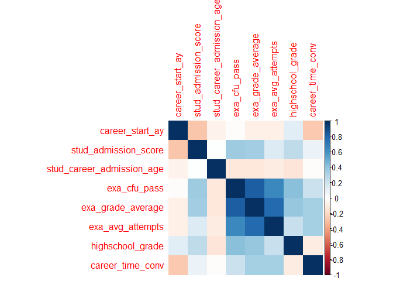

Regressione_new
================
Alessandro Wiget
2024-05-17

## Librerie

``` r
library(readxl)
library(dplyr)
library( faraway )
library( leaps )
library(MASS)
library( GGally)
library(BAS)
library(rgl)
library(corrplot)
library(pscl)
library(plm)
library(glmulti)
```

## Il Dataset

Prima di tutto definiamo la working directory:

IMPORTANTE! Cambiare la directoy a seconda del pc.

Importiamo il Dataset, presente nella cartella `Dati/`:

``` r
setwd("/home/alessandro/Inferenza Statistica/Progetto/Code")
df <- read_excel("../Dati/Dropout20240226_IngMate.xlsx")
#View(df)
```

## Regressione Logistica

Consideriamo innanzitutto solo gli studenti con carriere terminate, cioè
o che si sono laureati o che hanno abbandonato il corso di studio:

``` r
df$career_anonymous_id <- NULL
df$career_time <- NULL
df$stud_career_degree_start_id <- NULL
df$stud_career_degree_changed <- NULL
df$stud_career_degree_name <- NULL
df$stud_ofa_flst <- NULL
df$stud_ofa_fltp <- NULL
df$stud_career_degree_area <- NULL
df$stud_career_degree_code <- NULL
df$stud_career_degree_code_CdS <-NULL
df$highschool_type <- NULL
df$highschool_type_code <- NULL #abbiamo cancellato queste variabili operche possiamo separare fra classico, scientifico e altro con un'altra variabile
df$stud_admis_convent_start_dt <- NULL

filtered_df <- df %>% filter(stud_career_status != 'A')
```

Selezioniamo dal dataset le variabili numeriche:

``` r
numerical_vars <- sapply(filtered_df, is.numeric)  # Find numeric columns
numerical_df <- filtered_df[, numerical_vars]  # Subset dataframe with numeric columns
numerical_df = na.omit(numerical_df)
```

Osserviamo se esistono correlazioni significative fra i dati numerici:

``` r
X = numerical_df[, -4]
corrplot(cor(X), method='color')
```

<!-- -->

## La Prima Regressione Logistica

Effettuiamo la regressione logistica fra le variabili numeriche del
dataset:

``` r
# Create a formula for linear model
formula_num <- as.formula(paste("dropout ~", paste(names(numerical_df[,-which(names(numerical_df) == "dropout")]), collapse = " + ")))

# Fit the linear model
model <- glm(formula_num, data = numerical_df, family=binomial)

# Print the summary of the model
summary(model)
```

    ## 
    ## Call:
    ## glm(formula = formula_num, family = binomial, data = numerical_df)
    ## 
    ## Deviance Residuals: 
    ##     Min       1Q   Median       3Q      Max  
    ## -1.7120  -0.2907  -0.1961  -0.0782   4.5886  
    ## 
    ## Coefficients:
    ##                             Estimate Std. Error z value Pr(>|z|)    
    ## (Intercept)               120.995553  65.261589   1.854  0.06374 .  
    ## career_start_ay            -1.713397   0.357433  -4.794 1.64e-06 ***
    ## stud_admission_score        0.011294   0.010093   1.119  0.26314    
    ## stud_career_admission_age   0.400966   0.142329   2.817  0.00484 ** 
    ## exa_cfu_pass               -0.128186   0.015112  -8.482  < 2e-16 ***
    ## exa_grade_average          -0.058420   0.017805  -3.281  0.00103 ** 
    ## exa_avg_attempts            0.333251   0.240698   1.385  0.16620    
    ## stud_career_end_ay          1.654889   0.355049   4.661 3.15e-06 ***
    ## highschool_grade           -0.040491   0.009209  -4.397 1.10e-05 ***
    ## career_time_conv           -0.009152   0.001061  -8.629  < 2e-16 ***
    ## ---
    ## Signif. codes:  0 '***' 0.001 '**' 0.01 '*' 0.05 '.' 0.1 ' ' 1
    ## 
    ## (Dispersion parameter for binomial family taken to be 1)
    ## 
    ##     Null deviance: 2585.74  on 2462  degrees of freedom
    ## Residual deviance:  888.21  on 2453  degrees of freedom
    ## AIC: 908.21
    ## 
    ## Number of Fisher Scoring iterations: 7

Cerchiamo di trovare il miglior modello con un Automatic Selection
Method. Massimizziamo l’AIC con la funzione `glmulti()`. , presente
nell’omonima libreria:

``` r
glmulti.logistic.out <-
    glmulti(formula_num, data = numerical_df,
            level = 1,               # No interaction considered
            method = "h",            # Exhaustive approach
            crit = "aic",            # AIC as criteria
            confsetsize = 5,         # Keep 5 best models
            plotty = F, report = F,  # No plot or interim reports
            fitfunction = "glm",     # glm function
            family = binomial)       # binomial family for logistic regression

## Show 5 best models (Use @ instead of $ for an S4 object)
glmulti.logistic.out@formulas
```

    ## [[1]]
    ## dropout ~ 1 + career_start_ay + stud_career_admission_age + exa_cfu_pass + 
    ##     exa_grade_average + stud_career_end_ay + highschool_grade + 
    ##     career_time_conv
    ## <environment: 0x622159114348>
    ## 
    ## [[2]]
    ## dropout ~ 1 + career_start_ay + stud_career_admission_age + exa_cfu_pass + 
    ##     exa_grade_average + exa_avg_attempts + stud_career_end_ay + 
    ##     highschool_grade + career_time_conv
    ## <environment: 0x622159114348>
    ## 
    ## [[3]]
    ## dropout ~ 1 + career_start_ay + stud_admission_score + stud_career_admission_age + 
    ##     exa_cfu_pass + exa_grade_average + stud_career_end_ay + highschool_grade + 
    ##     career_time_conv
    ## <environment: 0x622159114348>
    ## 
    ## [[4]]
    ## dropout ~ 1 + career_start_ay + stud_admission_score + stud_career_admission_age + 
    ##     exa_cfu_pass + exa_grade_average + exa_avg_attempts + stud_career_end_ay + 
    ##     highschool_grade + career_time_conv
    ## <environment: 0x622159114348>
    ## 
    ## [[5]]
    ## dropout ~ 1 + career_start_ay + exa_cfu_pass + exa_grade_average + 
    ##     stud_career_end_ay + highschool_grade + career_time_conv
    ## <environment: 0x622159114348>

Vediamo un summary per il modello decretato “migliore”:

``` r
summary(glm("dropout ~ 1 + career_start_ay + stud_career_admission_age + exa_cfu_pass + 
    exa_grade_average + stud_career_end_ay + highschool_grade + 
    career_time_conv", data=numerical_df))
```

    ## 
    ## Call:
    ## glm(formula = "dropout ~ 1 + career_start_ay + stud_career_admission_age + exa_cfu_pass + \n    exa_grade_average + stud_career_end_ay + highschool_grade + \n    career_time_conv", 
    ##     data = numerical_df)
    ## 
    ## Deviance Residuals: 
    ##      Min        1Q    Median        3Q       Max  
    ## -0.62779  -0.11786  -0.03509   0.02530   1.58492  
    ## 
    ## Coefficients:
    ##                             Estimate Std. Error t value Pr(>|t|)    
    ## (Intercept)                1.443e+01  3.336e+00   4.324 1.59e-05 ***
    ## career_start_ay           -5.150e-02  1.875e-02  -2.748  0.00605 ** 
    ## stud_career_admission_age  2.119e-02  7.008e-03   3.023  0.00253 ** 
    ## exa_cfu_pass              -1.354e-02  8.710e-04 -15.550  < 2e-16 ***
    ## exa_grade_average         -6.681e-03  9.393e-04  -7.113 1.48e-12 ***
    ## stud_career_end_ay         4.487e-02  1.862e-02   2.410  0.01603 *  
    ## highschool_grade          -3.580e-03  5.455e-04  -6.563 6.41e-11 ***
    ## career_time_conv          -5.502e-04  5.007e-05 -10.989  < 2e-16 ***
    ## ---
    ## Signif. codes:  0 '***' 0.001 '**' 0.01 '*' 0.05 '.' 0.1 ' ' 1
    ## 
    ## (Dispersion parameter for gaussian family taken to be 0.0604306)
    ## 
    ##     Null deviance: 420.48  on 2462  degrees of freedom
    ## Residual deviance: 148.36  on 2455  degrees of freedom
    ## AIC: 87.861
    ## 
    ## Number of Fisher Scoring iterations: 2

Notiamo un enorme miglioramento nel modello, quindi lo teniamo come
migliore, per ora.

## Introduzione delle Variabili Categoriche

``` r
filtered_df <- df %>% filter(stud_career_status != 'A')
filtered_df_no_na = na.omit(filtered_df)

#Partendo dal modello di ottimo trovato prima costruisco la matrice solo con quelle covariate:
new_df <- numerical_df
new_df$stud_admission_score <- NULL
new_df$exa_avg_attempts <- NULL

new_df$stud_gender = factor(filtered_df_no_na$stud_gender, ordered = F)
new_df$previousStudies = factor(filtered_df_no_na$previousStudies, ordered = F)
new_df$origins = factor(filtered_df_no_na$origins, ordered = F)
new_df$income_bracket_normalized_on4 = factor(filtered_df_no_na$income_bracket_normalized_on4, ordered = F)
new_df$dropped_on_180 = factor(filtered_df_no_na$dropped_on_180, ordered = F)

#Costruiamo un modello con tutte le variabili categoriche:
formula_cat <- as.formula(paste("dropout ~", paste(names(new_df[,-which(names(new_df) == "dropout")]), collapse = " + ")))

model <- glm(formula_cat, data = new_df, family=binomial)

summary(model)
```

    ## 
    ## Call:
    ## glm(formula = formula_cat, family = binomial, data = new_df)
    ## 
    ## Deviance Residuals: 
    ##     Min       1Q   Median       3Q      Max  
    ## -1.6597  -0.2879  -0.1963  -0.0792   4.6252  
    ## 
    ## Coefficients:
    ##                                             Estimate Std. Error z value
    ## (Intercept)                               115.850175  66.197601   1.750
    ## career_start_ay                            -1.771181   0.365735  -4.843
    ## stud_career_admission_age                   0.382427   0.146546   2.610
    ## exa_cfu_pass                               -0.124546   0.015066  -8.267
    ## exa_grade_average                          -0.045218   0.014413  -3.137
    ## stud_career_end_ay                          1.715568   0.363807   4.716
    ## highschool_grade                           -0.037969   0.009734  -3.900
    ## career_time_conv                           -0.009317   0.001090  -8.544
    ## stud_genderM                                0.350796   0.198908   1.764
    ## previousStudiesOthers                       0.349568   0.679027   0.515
    ## previousStudiesScientifica                  0.123276   0.344588   0.358
    ## previousStudiesTecnica                      0.785954   0.526041   1.494
    ## originsForeigner                            0.297267   1.137421   0.261
    ## originsMilanese                            -0.104902   0.215290  -0.487
    ## originsOffsite                              0.490940   0.380766   1.289
    ## income_bracket_normalized_on4fascia bassa   0.077056   0.256302   0.301
    ## income_bracket_normalized_on4fascia media   0.042465   0.230357   0.184
    ## income_bracket_normalized_on4LS            -0.329423   0.321519  -1.025
    ## dropped_on_180Y                            11.814991 583.217750   0.020
    ##                                           Pr(>|z|)    
    ## (Intercept)                                0.08011 .  
    ## career_start_ay                           1.28e-06 ***
    ## stud_career_admission_age                  0.00906 ** 
    ## exa_cfu_pass                               < 2e-16 ***
    ## exa_grade_average                          0.00170 ** 
    ## stud_career_end_ay                        2.41e-06 ***
    ## highschool_grade                          9.60e-05 ***
    ## career_time_conv                           < 2e-16 ***
    ## stud_genderM                               0.07780 .  
    ## previousStudiesOthers                      0.60669    
    ## previousStudiesScientifica                 0.72053    
    ## previousStudiesTecnica                     0.13515    
    ## originsForeigner                           0.79382    
    ## originsMilanese                            0.62607    
    ## originsOffsite                             0.19728    
    ## income_bracket_normalized_on4fascia bassa  0.76369    
    ## income_bracket_normalized_on4fascia media  0.85374    
    ## income_bracket_normalized_on4LS            0.30556    
    ## dropped_on_180Y                            0.98384    
    ## ---
    ## Signif. codes:  0 '***' 0.001 '**' 0.01 '*' 0.05 '.' 0.1 ' ' 1
    ## 
    ## (Dispersion parameter for binomial family taken to be 1)
    ## 
    ##     Null deviance: 2585.74  on 2462  degrees of freedom
    ## Residual deviance:  880.65  on 2444  degrees of freedom
    ## AIC: 918.65
    ## 
    ## Number of Fisher Scoring iterations: 17

Proviamo a migliorarlo con `glmulti()`:

``` r
glmulti.logistic.out <-
    glmulti(formula_cat, data = new_df,
            level = 1,               # No interaction considered
            method = "h",            # Exhaustive approach
            crit = "aic",            # AIC as criteria
            confsetsize = 5,         # Keep 5 best models
            plotty = F, report = F,  # No plot or interim reports
            fitfunction = "glm",     # glm function
            family = binomial)       # binomial family for logistic regression

## Show 5 best models (Use @ instead of $ for an S4 object)
glmulti.logistic.out@formulas
```

    ## [[1]]
    ## dropout ~ 1 + stud_gender + career_start_ay + stud_career_admission_age + 
    ##     exa_cfu_pass + exa_grade_average + stud_career_end_ay + highschool_grade + 
    ##     career_time_conv
    ## <environment: 0x622159078b08>
    ## 
    ## [[2]]
    ## dropout ~ 1 + career_start_ay + stud_career_admission_age + exa_cfu_pass + 
    ##     exa_grade_average + stud_career_end_ay + highschool_grade + 
    ##     career_time_conv
    ## <environment: 0x622159078b08>
    ## 
    ## [[3]]
    ## dropout ~ 1 + stud_gender + dropped_on_180 + career_start_ay + 
    ##     stud_career_admission_age + exa_cfu_pass + exa_grade_average + 
    ##     stud_career_end_ay + highschool_grade + career_time_conv
    ## <environment: 0x622159078b08>
    ## 
    ## [[4]]
    ## dropout ~ 1 + dropped_on_180 + career_start_ay + stud_career_admission_age + 
    ##     exa_cfu_pass + exa_grade_average + stud_career_end_ay + highschool_grade + 
    ##     career_time_conv
    ## <environment: 0x622159078b08>
    ## 
    ## [[5]]
    ## dropout ~ 1 + stud_gender + previousStudies + career_start_ay + 
    ##     stud_career_admission_age + exa_cfu_pass + exa_grade_average + 
    ##     stud_career_end_ay + highschool_grade + career_time_conv
    ## <environment: 0x622159078b08>

Osserviamo il modello ottimale trovato:

``` r
glm_cat = glm("dropout ~ 1 + stud_gender + career_start_ay + stud_career_admission_age + 
    exa_cfu_pass + exa_grade_average + stud_career_end_ay + highschool_grade + 
    career_time_conv", data=new_df)

summary(glm_cat)
```

    ## 
    ## Call:
    ## glm(formula = "dropout ~ 1 + stud_gender + career_start_ay + stud_career_admission_age + \n    exa_cfu_pass + exa_grade_average + stud_career_end_ay + highschool_grade + \n    career_time_conv", 
    ##     data = new_df)
    ## 
    ## Deviance Residuals: 
    ##      Min        1Q    Median        3Q       Max  
    ## -0.61001  -0.11171  -0.03768   0.02709   1.60387  
    ## 
    ## Coefficients:
    ##                             Estimate Std. Error t value Pr(>|t|)    
    ## (Intercept)                1.448e+01  3.330e+00   4.348 1.43e-05 ***
    ## stud_genderM               3.468e-02  1.042e-02   3.329 0.000885 ***
    ## career_start_ay           -5.077e-02  1.871e-02  -2.714 0.006699 ** 
    ## stud_career_admission_age  2.046e-02  6.997e-03   2.924 0.003490 ** 
    ## exa_cfu_pass              -1.370e-02  8.705e-04 -15.741  < 2e-16 ***
    ## exa_grade_average         -6.844e-03  9.387e-04  -7.292 4.11e-13 ***
    ## stud_career_end_ay         4.409e-02  1.858e-02   2.373 0.017728 *  
    ## highschool_grade          -3.284e-03  5.516e-04  -5.953 3.01e-09 ***
    ## career_time_conv          -5.467e-04  4.997e-05 -10.939  < 2e-16 ***
    ## ---
    ## Signif. codes:  0 '***' 0.001 '**' 0.01 '*' 0.05 '.' 0.1 ' ' 1
    ## 
    ## (Dispersion parameter for gaussian family taken to be 0.06018349)
    ## 
    ##     Null deviance: 420.48  on 2462  degrees of freedom
    ## Residual deviance: 147.69  on 2454  degrees of freedom
    ## AIC: 78.765
    ## 
    ## Number of Fisher Scoring iterations: 2

Notiamo un effettivo miglioramento rispetto al modello che contiene solo
covariate numeriche, manteniamo quindi la covariata che esprime il
genere dello studente.

## Introduzione delle Interazioni

Cerchiamo di capire se, introducendo delle interazioni fra le covariate
del modello ottimale trovato finora siamo in grado di ridurre
ulteriormente l’AIC.

Iniziamo ad introdurre le interazioni fra genere e le covariate
numeriche:

``` r
int_df = new_df

int_df$previousStudies = NULL
int_df$origins = NULL
int_df$income_bracket_normalized_on4 = NULL
int_df$dropped_on_180 = NULL

covariate = paste("dropout ~", paste(names(int_df[,-which(names(int_df) == "dropout")]), collapse = " + "))

interazioni = "+ stud_gender*career_start_ay +  stud_gender*stud_career_admission_age + stud_gender*exa_cfu_pass + stud_gender*exa_grade_average + stud_gender*stud_career_end_ay +  stud_gender*highschool_grade  + stud_gender*career_time_conv"

formula_int <- as.formula(paste(covariate, interazioni))

model <- glm(formula_int, data = int_df, family=binomial)

summary(model)
```

    ## 
    ## Call:
    ## glm(formula = formula_int, family = binomial, data = int_df)
    ## 
    ## Deviance Residuals: 
    ##     Min       1Q   Median       3Q      Max  
    ## -1.7981  -0.2969  -0.1894  -0.0773   5.0219  
    ## 
    ## Coefficients:
    ##                                          Estimate Std. Error z value Pr(>|z|)
    ## (Intercept)                             64.339802 119.424232   0.539  0.59006
    ## career_start_ay                         -2.043883   0.706161  -2.894  0.00380
    ## stud_career_admission_age                0.585296   0.255246   2.293  0.02184
    ## exa_cfu_pass                            -0.168889   0.029998  -5.630 1.80e-08
    ## exa_grade_average                       -0.040728   0.026022  -1.565  0.11755
    ## stud_career_end_ay                       2.012293   0.696929   2.887  0.00388
    ## highschool_grade                        -0.026455   0.017698  -1.495  0.13495
    ## career_time_conv                        -0.010905   0.002107  -5.175 2.28e-07
    ## stud_genderM                           126.821557 140.778037   0.901  0.36766
    ## career_start_ay:stud_genderM             0.431240   0.821093   0.525  0.59944
    ## stud_career_admission_age:stud_genderM  -0.258643   0.308914  -0.837  0.40244
    ## exa_cfu_pass:stud_genderM                0.060051   0.034636   1.734  0.08296
    ## exa_grade_average:stud_genderM          -0.003127   0.031168  -0.100  0.92009
    ## stud_career_end_ay:stud_genderM         -0.492028   0.812398  -0.606  0.54475
    ## highschool_grade:stud_genderM           -0.017414   0.020893  -0.833  0.40458
    ## career_time_conv:stud_genderM            0.002481   0.002444   1.015  0.31017
    ##                                           
    ## (Intercept)                               
    ## career_start_ay                        ** 
    ## stud_career_admission_age              *  
    ## exa_cfu_pass                           ***
    ## exa_grade_average                         
    ## stud_career_end_ay                     ** 
    ## highschool_grade                          
    ## career_time_conv                       ***
    ## stud_genderM                              
    ## career_start_ay:stud_genderM              
    ## stud_career_admission_age:stud_genderM    
    ## exa_cfu_pass:stud_genderM              .  
    ## exa_grade_average:stud_genderM            
    ## stud_career_end_ay:stud_genderM           
    ## highschool_grade:stud_genderM             
    ## career_time_conv:stud_genderM             
    ## ---
    ## Signif. codes:  0 '***' 0.001 '**' 0.01 '*' 0.05 '.' 0.1 ' ' 1
    ## 
    ## (Dispersion parameter for binomial family taken to be 1)
    ## 
    ##     Null deviance: 2585.74  on 2462  degrees of freedom
    ## Residual deviance:  877.13  on 2447  degrees of freedom
    ## AIC: 909.13
    ## 
    ## Number of Fisher Scoring iterations: 7

Ottimizziamo come al solito:

``` r
glmulti.logistic.out <-
    glmulti(formula_int, data = int_df,
            level = 1,               # No interaction considered
            method = "h",            # Exhaustive approach
            crit = "aic",            # AIC as criteria
            confsetsize = 10,         # Keep 5 best models
            plotty = F, report = F,  # No plot or interim reports
            fitfunction = "glm",     # glm function
            family = binomial)       # binomial family for logistic regression

## Show 5 best models (Use @ instead of $ for an S4 object)
glmulti.logistic.out@formulas
```

    ## [[1]]
    ## dropout ~ 1 + stud_gender + career_start_ay + stud_career_admission_age + 
    ##     exa_cfu_pass + exa_grade_average + stud_career_end_ay + highschool_grade + 
    ##     career_time_conv
    ## <environment: 0x622158ac4058>
    ## 
    ## [[2]]
    ## dropout ~ 1 + career_start_ay + stud_career_admission_age + exa_cfu_pass + 
    ##     exa_grade_average + stud_career_end_ay + highschool_grade + 
    ##     career_time_conv
    ## <environment: 0x622158ac4058>
    ## 
    ## [[3]]
    ## dropout ~ 1 + stud_gender + career_start_ay + exa_cfu_pass + 
    ##     exa_grade_average + stud_career_end_ay + highschool_grade + 
    ##     career_time_conv
    ## <environment: 0x622158ac4058>
    ## 
    ## [[4]]
    ## dropout ~ 1 + career_start_ay + exa_cfu_pass + exa_grade_average + 
    ##     stud_career_end_ay + highschool_grade + career_time_conv
    ## <environment: 0x622158ac4058>
    ## 
    ## [[5]]
    ## dropout ~ 1 + stud_gender + career_start_ay + stud_career_admission_age + 
    ##     exa_cfu_pass + stud_career_end_ay + highschool_grade + career_time_conv
    ## <environment: 0x622158ac4058>
    ## 
    ## [[6]]
    ## dropout ~ 1 + career_start_ay + stud_career_admission_age + exa_cfu_pass + 
    ##     stud_career_end_ay + highschool_grade + career_time_conv
    ## <environment: 0x622158ac4058>
    ## 
    ## [[7]]
    ## dropout ~ 1 + stud_gender + career_start_ay + stud_career_admission_age + 
    ##     exa_cfu_pass + exa_grade_average + stud_career_end_ay + career_time_conv
    ## <environment: 0x622158ac4058>
    ## 
    ## [[8]]
    ## dropout ~ 1 + stud_gender + career_start_ay + exa_cfu_pass + 
    ##     stud_career_end_ay + highschool_grade + career_time_conv
    ## <environment: 0x622158ac4058>
    ## 
    ## [[9]]
    ## dropout ~ 1 + career_start_ay + exa_cfu_pass + stud_career_end_ay + 
    ##     highschool_grade + career_time_conv
    ## <environment: 0x622158ac4058>
    ## 
    ## [[10]]
    ## dropout ~ 1 + career_start_ay + stud_career_admission_age + exa_cfu_pass + 
    ##     exa_grade_average + stud_career_end_ay + career_time_conv
    ## <environment: 0x622158ac4058>

Osserviamo l’output:

``` r
glm_cat = glm("dropout ~ 1 + stud_gender + career_start_ay + stud_career_admission_age + 
    exa_cfu_pass + exa_grade_average + stud_career_end_ay + highschool_grade + 
    career_time_conv", data=int_df)

summary(glm_cat)
```

    ## 
    ## Call:
    ## glm(formula = "dropout ~ 1 + stud_gender + career_start_ay + stud_career_admission_age + \n    exa_cfu_pass + exa_grade_average + stud_career_end_ay + highschool_grade + \n    career_time_conv", 
    ##     data = int_df)
    ## 
    ## Deviance Residuals: 
    ##      Min        1Q    Median        3Q       Max  
    ## -0.61001  -0.11171  -0.03768   0.02709   1.60387  
    ## 
    ## Coefficients:
    ##                             Estimate Std. Error t value Pr(>|t|)    
    ## (Intercept)                1.448e+01  3.330e+00   4.348 1.43e-05 ***
    ## stud_genderM               3.468e-02  1.042e-02   3.329 0.000885 ***
    ## career_start_ay           -5.077e-02  1.871e-02  -2.714 0.006699 ** 
    ## stud_career_admission_age  2.046e-02  6.997e-03   2.924 0.003490 ** 
    ## exa_cfu_pass              -1.370e-02  8.705e-04 -15.741  < 2e-16 ***
    ## exa_grade_average         -6.844e-03  9.387e-04  -7.292 4.11e-13 ***
    ## stud_career_end_ay         4.409e-02  1.858e-02   2.373 0.017728 *  
    ## highschool_grade          -3.284e-03  5.516e-04  -5.953 3.01e-09 ***
    ## career_time_conv          -5.467e-04  4.997e-05 -10.939  < 2e-16 ***
    ## ---
    ## Signif. codes:  0 '***' 0.001 '**' 0.01 '*' 0.05 '.' 0.1 ' ' 1
    ## 
    ## (Dispersion parameter for gaussian family taken to be 0.06018349)
    ## 
    ##     Null deviance: 420.48  on 2462  degrees of freedom
    ## Residual deviance: 147.69  on 2454  degrees of freedom
    ## AIC: 78.765
    ## 
    ## Number of Fisher Scoring iterations: 2

Manteniamo il modello precedente. A quanto pare le interazioni non sono
importanti per il modello e i dati, ciò è garantito anche dal fatto che
nei primi 10 modelli ottimi, nessuno utilizzi le covariate introdotte.
