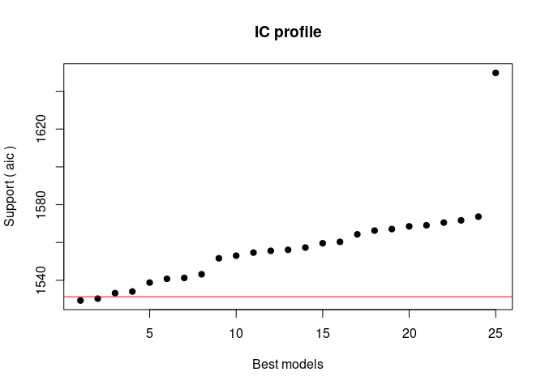
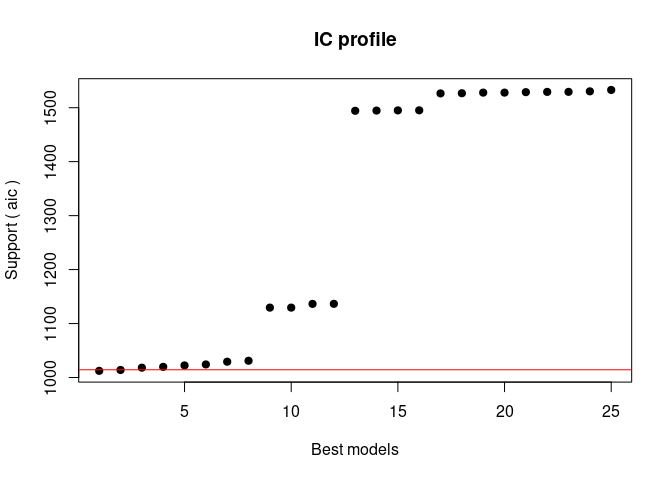
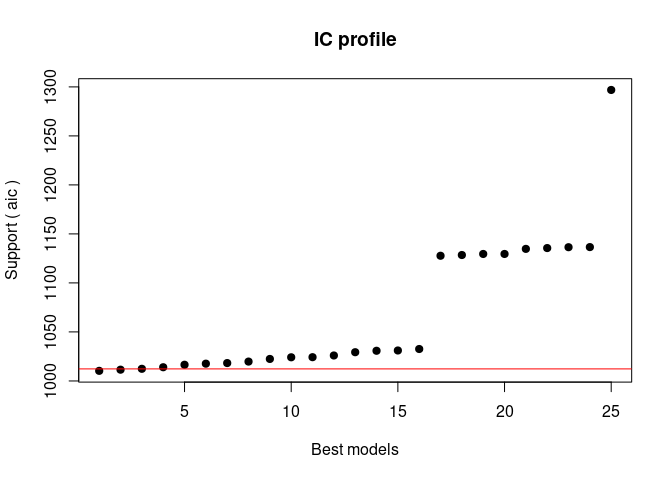
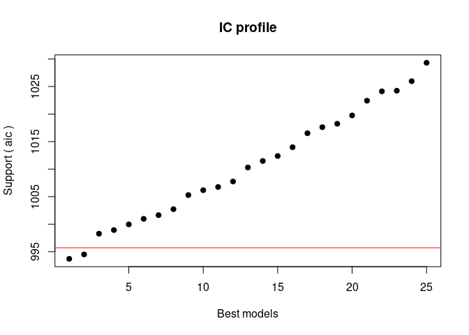
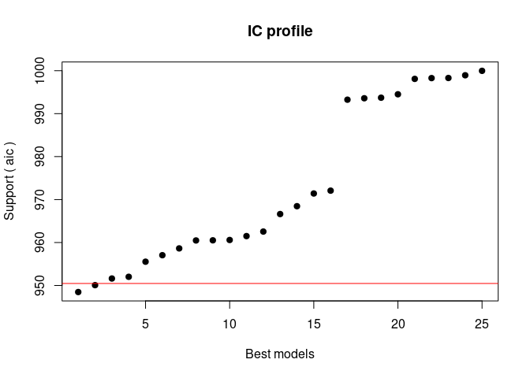
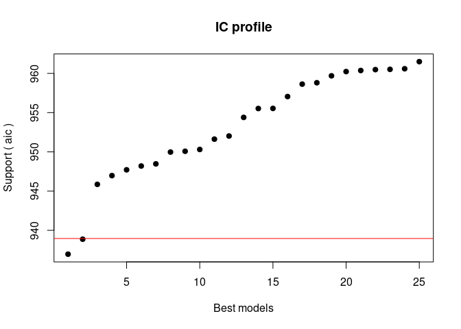
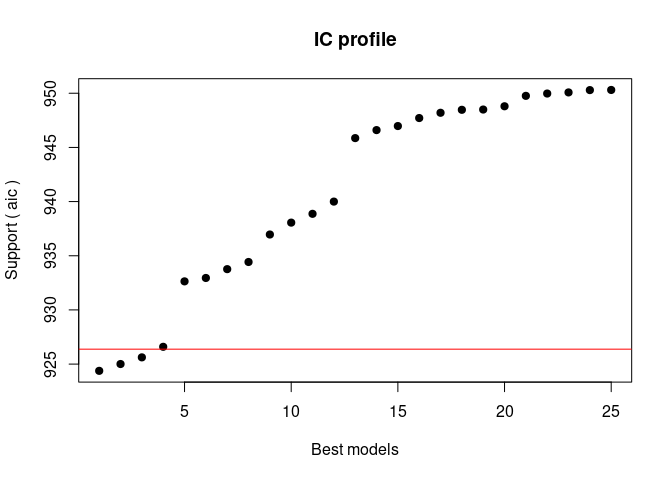
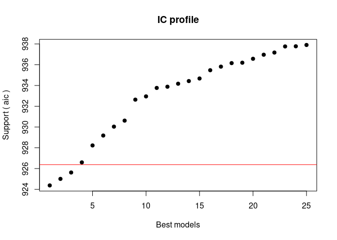
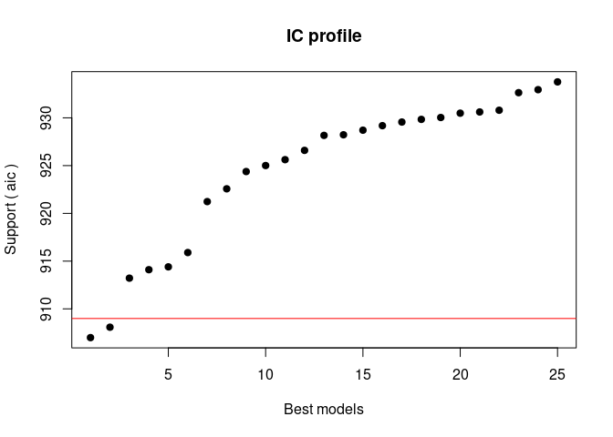

Regressione_new
================
Alessandro Wiget
2024-05-19

## Librerie

``` r
library(readxl)
library(dplyr)
library( faraway )
library( leaps )
library(MASS)
library( GGally)
library(BAS)
library(rgl)
library(corrplot)
library(pscl)
library(plm)
library(glmulti)
library(AICcmodavg)
```

## Il Dataset

Prima di tutto definiamo la working directory:

IMPORTANTE! Cambiare la directoy a seconda del pc.

Importiamo il Dataset, presente nella cartella `Dati/`:

``` r
setwd("/home/alessandro/Inferenza Statistica/Progetto/Code")
df <- read_excel("../Dati/Dropout20240226_IngMate.xlsx")
#View(df)
```

## Regressione Logistica

Consideriamo innanzitutto solo gli studenti con carriere terminate, cioè
o che si sono laureati o che hanno abbandonato il corso di studio:

``` r
df$career_anonymous_id <- NULL
df$career_time <- NULL
df$stud_career_degree_start_id <- NULL
df$stud_career_degree_changed <- NULL
df$stud_career_degree_name <- NULL
df$stud_ofa_flst <- NULL
df$stud_ofa_fltp <- NULL
df$stud_career_degree_area <- NULL
df$stud_career_degree_code <- NULL
df$stud_career_degree_code_CdS <-NULL
df$highschool_type <- NULL
df$highschool_type_code <- NULL #abbiamo cancellato queste variabili operche possiamo separare fra classico, scientifico e altro con un'altra variabile
df$stud_admis_convent_start_dt <- NULL

filtered_df <- df %>% filter(stud_career_status != 'A')
```

Selezioniamo dal dataset le variabili numeriche:

``` r
numerical_vars <- sapply(filtered_df, is.numeric)  # Find numeric columns
numerical_df <- filtered_df[, numerical_vars]  # Subset dataframe with numeric columns
numerical_df = na.omit(numerical_df)
```

Osserviamo se esistono correlazioni significative fra i dati numerici:

``` r
X = numerical_df[, -4]
corrplot(cor(X), method='color')
```

<!-- -->

## La Prima Regressione Logistica

Effettuiamo la regressione logistica fra le variabili numeriche del
dataset, e vediamo quanto vale inizialmente l’adjustedR2:

``` r
# Create a formula for linear model
formula_num <- as.formula(paste("dropout ~", paste(names(numerical_df[,-which(names(numerical_df) == "dropout")]), collapse = " + ")))

# Fit the linear model
model_init <- glm(formula_num, data = numerical_df, family=binomial)

# Print the summary of the model
summary(model_init)
```

    ## 
    ## Call:
    ## glm(formula = formula_num, family = binomial, data = numerical_df)
    ## 
    ## Deviance Residuals: 
    ##     Min       1Q   Median       3Q      Max  
    ## -1.7120  -0.2907  -0.1961  -0.0782   4.5886  
    ## 
    ## Coefficients:
    ##                             Estimate Std. Error z value Pr(>|z|)    
    ## (Intercept)               120.995553  65.261589   1.854  0.06374 .  
    ## career_start_ay            -1.713397   0.357433  -4.794 1.64e-06 ***
    ## stud_admission_score        0.011294   0.010093   1.119  0.26314    
    ## stud_career_admission_age   0.400966   0.142329   2.817  0.00484 ** 
    ## exa_cfu_pass               -0.128186   0.015112  -8.482  < 2e-16 ***
    ## exa_grade_average          -0.058420   0.017805  -3.281  0.00103 ** 
    ## exa_avg_attempts            0.333251   0.240698   1.385  0.16620    
    ## stud_career_end_ay          1.654889   0.355049   4.661 3.15e-06 ***
    ## highschool_grade           -0.040491   0.009209  -4.397 1.10e-05 ***
    ## career_time_conv           -0.009152   0.001061  -8.629  < 2e-16 ***
    ## ---
    ## Signif. codes:  0 '***' 0.001 '**' 0.01 '*' 0.05 '.' 0.1 ' ' 1
    ## 
    ## (Dispersion parameter for binomial family taken to be 1)
    ## 
    ##     Null deviance: 2585.74  on 2462  degrees of freedom
    ## Residual deviance:  888.21  on 2453  degrees of freedom
    ## AIC: 908.21
    ## 
    ## Number of Fisher Scoring iterations: 7

``` r
pseudo_r2 <- pR2(model_init)
```

    ## fitting null model for pseudo-r2

``` r
pseudo_r2['McFadden']
```

    ##  McFadden 
    ## 0.6564982

Iniziamo da un valore di adjustedR2 di 0.656, quindi già buono, vediamo
adesso di trovare un buon modello logistico, che dunque minimizzi l’AIC.

Utilizziamo un Automatic Selection Method. Minimizziamo l’AIC con la
funzione `glmulti()`, presente nell’omonima libreria.

``` r
glmulti.logistic.out <-
    glmulti(formula_num, data = numerical_df,
            level = 1,               # No interaction considered
            method = "h",            # Exhaustive approach
            crit = "aic",            # AIC as criteria
            confsetsize = 25,         # Keep 5 best models
            plotty = T, report = T,  # plot or interim reports
            fitfunction = "glm",     # glm function
            family = binomial)       # binomial family for logistic regression
```

    ## Initialization...
    ## TASK: Exhaustive screening of candidate set.
    ## Fitting...
    ## 
    ## After 50 models:
    ## Best model: dropout~1+career_start_ay+stud_career_admission_age+exa_cfu_pass+exa_grade_average
    ## Crit= 1529.27547800634
    ## Mean crit= 1557.59476541779

<!-- -->

    ## 
    ## After 100 models:
    ## Best model: dropout~1+career_start_ay+stud_career_admission_age+exa_cfu_pass+exa_grade_average+stud_career_end_ay
    ## Crit= 1012.38054469747
    ## Mean crit= 1297.69062388251

<!-- -->

    ## 
    ## After 150 models:
    ## Best model: dropout~1+career_start_ay+stud_career_admission_age+exa_cfu_pass+exa_grade_average+exa_avg_attempts+stud_career_end_ay
    ## Crit= 1010.29831393719
    ## Mean crit= 1067.84729431362

    ## 
    ## After 200 models:
    ## Best model: dropout~1+career_start_ay+stud_career_admission_age+exa_cfu_pass+exa_grade_average+exa_avg_attempts+stud_career_end_ay
    ## Crit= 1010.29831393719
    ## Mean crit= 1067.84729431362

<!-- -->

    ## 
    ## After 250 models:
    ## Best model: dropout~1+career_start_ay+stud_career_admission_age+exa_cfu_pass+exa_grade_average+stud_career_end_ay+highschool_grade
    ## Crit= 993.711345471493
    ## Mean crit= 1010.52074154865

<!-- -->

    ## 
    ## After 300 models:
    ## Best model: dropout~1+career_start_ay+stud_career_admission_age+exa_cfu_pass+exa_grade_average+career_time_conv
    ## Crit= 948.472043967588
    ## Mean crit= 973.049031965309

<!-- -->

    ## 
    ## After 350 models:
    ## Best model: dropout~1+career_start_ay+stud_career_admission_age+exa_cfu_pass+stud_career_end_ay+career_time_conv
    ## Crit= 936.96149050757
    ## Mean crit= 953.214348629333

<!-- -->

    ## 
    ## After 400 models:
    ## Best model: dropout~1+career_start_ay+stud_career_admission_age+exa_cfu_pass+exa_grade_average+exa_avg_attempts+stud_career_end_ay+career_time_conv
    ## Crit= 924.376745947487
    ## Mean crit= 940.831265371242

<!-- -->

    ## 
    ## After 450 models:
    ## Best model: dropout~1+career_start_ay+stud_career_admission_age+exa_cfu_pass+exa_grade_average+exa_avg_attempts+stud_career_end_ay+career_time_conv
    ## Crit= 924.376745947487
    ## Mean crit= 932.95706860444

<!-- -->

    ## 
    ## After 500 models:
    ## Best model: dropout~1+career_start_ay+stud_career_admission_age+exa_cfu_pass+exa_grade_average+stud_career_end_ay+highschool_grade+career_time_conv
    ## Crit= 906.988523782786
    ## Mean crit= 924.52176257677

<!-- -->

    ## Completed.

``` r
## Show 5 best models (Use @ instead of $ for an S4 object)
glmulti.logistic.out@formulas
```

    ## [[1]]
    ## dropout ~ 1 + career_start_ay + stud_career_admission_age + exa_cfu_pass + 
    ##     exa_grade_average + stud_career_end_ay + highschool_grade + 
    ##     career_time_conv
    ## <environment: 0x5c7f84caaed0>
    ## 
    ## [[2]]
    ## dropout ~ 1 + career_start_ay + stud_career_admission_age + exa_cfu_pass + 
    ##     exa_grade_average + exa_avg_attempts + stud_career_end_ay + 
    ##     highschool_grade + career_time_conv
    ## <environment: 0x5c7f84caaed0>
    ## 
    ## [[3]]
    ## dropout ~ 1 + career_start_ay + stud_admission_score + stud_career_admission_age + 
    ##     exa_cfu_pass + exa_grade_average + stud_career_end_ay + highschool_grade + 
    ##     career_time_conv
    ## <environment: 0x5c7f84caaed0>
    ## 
    ## [[4]]
    ## dropout ~ 1 + career_start_ay + stud_admission_score + stud_career_admission_age + 
    ##     exa_cfu_pass + exa_grade_average + exa_avg_attempts + stud_career_end_ay + 
    ##     highschool_grade + career_time_conv
    ## <environment: 0x5c7f84caaed0>
    ## 
    ## [[5]]
    ## dropout ~ 1 + career_start_ay + exa_cfu_pass + exa_grade_average + 
    ##     stud_career_end_ay + highschool_grade + career_time_conv
    ## <environment: 0x5c7f84caaed0>
    ## 
    ## [[6]]
    ## dropout ~ 1 + career_start_ay + exa_cfu_pass + exa_grade_average + 
    ##     exa_avg_attempts + stud_career_end_ay + highschool_grade + 
    ##     career_time_conv
    ## <environment: 0x5c7f84caaed0>
    ## 
    ## [[7]]
    ## dropout ~ 1 + career_start_ay + stud_admission_score + exa_cfu_pass + 
    ##     exa_grade_average + stud_career_end_ay + highschool_grade + 
    ##     career_time_conv
    ## <environment: 0x5c7f84caaed0>
    ## 
    ## [[8]]
    ## dropout ~ 1 + career_start_ay + stud_career_admission_age + exa_cfu_pass + 
    ##     stud_career_end_ay + highschool_grade + career_time_conv
    ## <environment: 0x5c7f84caaed0>
    ## 
    ## [[9]]
    ## dropout ~ 1 + career_start_ay + stud_admission_score + exa_cfu_pass + 
    ##     exa_grade_average + exa_avg_attempts + stud_career_end_ay + 
    ##     highschool_grade + career_time_conv
    ## <environment: 0x5c7f84caaed0>
    ## 
    ## [[10]]
    ## dropout ~ 1 + career_start_ay + stud_career_admission_age + exa_cfu_pass + 
    ##     exa_avg_attempts + stud_career_end_ay + highschool_grade + 
    ##     career_time_conv
    ## <environment: 0x5c7f84caaed0>
    ## 
    ## [[11]]
    ## dropout ~ 1 + career_start_ay + stud_admission_score + stud_career_admission_age + 
    ##     exa_cfu_pass + stud_career_end_ay + highschool_grade + career_time_conv
    ## <environment: 0x5c7f84caaed0>
    ## 
    ## [[12]]
    ## dropout ~ 1 + career_start_ay + stud_admission_score + stud_career_admission_age + 
    ##     exa_cfu_pass + exa_avg_attempts + stud_career_end_ay + highschool_grade + 
    ##     career_time_conv
    ## <environment: 0x5c7f84caaed0>
    ## 
    ## [[13]]
    ## dropout ~ 1 + career_start_ay + exa_cfu_pass + stud_career_end_ay + 
    ##     highschool_grade + career_time_conv
    ## <environment: 0x5c7f84caaed0>
    ## 
    ## [[14]]
    ## dropout ~ 1 + career_start_ay + exa_cfu_pass + exa_avg_attempts + 
    ##     stud_career_end_ay + highschool_grade + career_time_conv
    ## <environment: 0x5c7f84caaed0>
    ## 
    ## [[15]]
    ## dropout ~ 1 + career_start_ay + stud_admission_score + exa_cfu_pass + 
    ##     stud_career_end_ay + highschool_grade + career_time_conv
    ## <environment: 0x5c7f84caaed0>
    ## 
    ## [[16]]
    ## dropout ~ 1 + career_start_ay + stud_admission_score + exa_cfu_pass + 
    ##     exa_avg_attempts + stud_career_end_ay + highschool_grade + 
    ##     career_time_conv
    ## <environment: 0x5c7f84caaed0>
    ## 
    ## [[17]]
    ## dropout ~ 1 + career_start_ay + stud_career_admission_age + exa_cfu_pass + 
    ##     exa_grade_average + exa_avg_attempts + stud_career_end_ay + 
    ##     career_time_conv
    ## <environment: 0x5c7f84caaed0>
    ## 
    ## [[18]]
    ## dropout ~ 1 + career_start_ay + stud_career_admission_age + exa_cfu_pass + 
    ##     exa_grade_average + stud_career_end_ay + career_time_conv
    ## <environment: 0x5c7f84caaed0>
    ## 
    ## [[19]]
    ## dropout ~ 1 + career_start_ay + stud_admission_score + stud_career_admission_age + 
    ##     exa_cfu_pass + exa_grade_average + exa_avg_attempts + stud_career_end_ay + 
    ##     career_time_conv
    ## <environment: 0x5c7f84caaed0>
    ## 
    ## [[20]]
    ## dropout ~ 1 + career_start_ay + stud_admission_score + stud_career_admission_age + 
    ##     exa_cfu_pass + exa_grade_average + stud_career_end_ay + career_time_conv
    ## <environment: 0x5c7f84caaed0>
    ## 
    ## [[21]]
    ## dropout ~ 1 + career_start_ay + stud_career_admission_age + exa_cfu_pass + 
    ##     exa_grade_average + exa_avg_attempts + highschool_grade + 
    ##     career_time_conv
    ## <environment: 0x5c7f84caaed0>
    ## 
    ## [[22]]
    ## dropout ~ 1 + career_start_ay + stud_career_admission_age + exa_cfu_pass + 
    ##     exa_grade_average + highschool_grade + career_time_conv
    ## <environment: 0x5c7f84caaed0>
    ## 
    ## [[23]]
    ## dropout ~ 1 + career_start_ay + stud_admission_score + stud_career_admission_age + 
    ##     exa_cfu_pass + exa_grade_average + exa_avg_attempts + highschool_grade + 
    ##     career_time_conv
    ## <environment: 0x5c7f84caaed0>
    ## 
    ## [[24]]
    ## dropout ~ 1 + career_start_ay + stud_admission_score + stud_career_admission_age + 
    ##     exa_cfu_pass + exa_grade_average + highschool_grade + career_time_conv
    ## <environment: 0x5c7f84caaed0>
    ## 
    ## [[25]]
    ## dropout ~ 1 + stud_admission_score + stud_career_admission_age + 
    ##     exa_cfu_pass + exa_grade_average + exa_avg_attempts + highschool_grade + 
    ##     career_time_conv
    ## <environment: 0x5c7f84caaed0>

Restringiamoci al miglior modello per ogni numero di variabli
(l’intercetta conta come variabile extra), e mostriamo anche i
rispettivi adjustedR2:

``` r
model_opt_7 = glm("dropout ~ 1 + career_start_ay + stud_career_admission_age + exa_cfu_pass + 
    exa_grade_average + stud_career_end_ay + highschool_grade + 
    career_time_conv", data=numerical_df, family=binomial)

model_opt_6 = glm("dropout ~ 1 + career_start_ay + exa_cfu_pass + exa_grade_average + 
    stud_career_end_ay + highschool_grade + career_time_conv", data=numerical_df, family=binomial)

model_opt_5 = glm("dropout ~ 1 + career_start_ay + exa_cfu_pass + stud_career_end_ay + 
    highschool_grade + career_time_conv", data=numerical_df, family=binomial)

models  = list(model_init, model_opt_7, model_opt_6, model_opt_5)
model.names = c('Modello iniziale', 'Modello Ottimo con 7 Var', 'Modello Ottimo con 6 Var', 'Modello Ottimo con 5 Var')
aictab(cand.set = models, modnames = model.names)
```

    ## 
    ## Model selection based on AICc:
    ## 
    ##                           K   AICc Delta_AICc AICcWt Cum.Wt      LL
    ## Modello Ottimo con 7 Var  8 907.05       0.00   0.63   0.63 -445.49
    ## Modello iniziale         10 908.30       1.25   0.34   0.97 -444.10
    ## Modello Ottimo con 6 Var  7 913.26       6.21   0.03   1.00 -449.61
    ## Modello Ottimo con 5 Var  6 921.26      14.22   0.00   1.00 -454.62

``` r
print("Pseudo-R2 values:")
```

    ## [1] "Pseudo-R2 values:"

``` r
sprintf("model_init: %f", pR2(model_init)['McFadden'])
```

    ## fitting null model for pseudo-r2

    ## [1] "model_init: 0.656498"

``` r
sprintf("model_opt_7: %f", pR2(model_opt_7)['McFadden'])
```

    ## fitting null model for pseudo-r2

    ## [1] "model_opt_7: 0.655423"

``` r
sprintf("model_opt_6: %f", pR2(model_opt_6)['McFadden'])
```

    ## fitting null model for pseudo-r2

    ## [1] "model_opt_6: 0.652241"

``` r
sprintf("model_opt_5: %f", pR2(model_opt_5)['McFadden'])
```

    ## fitting null model for pseudo-r2

    ## [1] "model_opt_5: 0.648368"

Non notiamo un peggioramento troppo elevato né dell’AIC né dell’adjR2
utilizzando il modello a 5 covariate, quindi prendiamo in considerazione
quest’ultimo.

Effettuiamo una ricerca backward dal modello finale per cercare di
trovare un modello simile ma con un processo più logico.

``` r
covariate = paste("dropout ~", paste(names(numerical_df[,-which(names(numerical_df) == "dropout")]), collapse = " + "))

#Covariate rimosse durante la semplificazione, in ordine
rimosso =  paste("- stud_admission_score - exa_avg_attempts - stud_career_admission_age - exa_grade_average")

formula_num <- as.formula(paste(covariate, rimosso))

# Fit the linear model
model_back <- glm(formula_num, data = numerical_df, family=binomial)

# Print the summary of the model
summary(model_back)
```

    ## 
    ## Call:
    ## glm(formula = formula_num, family = binomial, data = numerical_df)
    ## 
    ## Deviance Residuals: 
    ##     Min       1Q   Median       3Q      Max  
    ## -1.5242  -0.2997  -0.1880  -0.0795   4.4648  
    ## 
    ## Coefficients:
    ##                      Estimate Std. Error z value Pr(>|z|)    
    ## (Intercept)        159.196055  61.229022   2.600  0.00932 ** 
    ## career_start_ay     -1.641886   0.347964  -4.719 2.38e-06 ***
    ## exa_cfu_pass        -0.157293   0.010659 -14.757  < 2e-16 ***
    ## stud_career_end_ay   1.568489   0.345837   4.535 5.75e-06 ***
    ## highschool_grade    -0.045653   0.008900  -5.130 2.90e-07 ***
    ## career_time_conv    -0.008830   0.001028  -8.587  < 2e-16 ***
    ## ---
    ## Signif. codes:  0 '***' 0.001 '**' 0.01 '*' 0.05 '.' 0.1 ' ' 1
    ## 
    ## (Dispersion parameter for binomial family taken to be 1)
    ## 
    ##     Null deviance: 2585.74  on 2462  degrees of freedom
    ## Residual deviance:  909.23  on 2457  degrees of freedom
    ## AIC: 921.23
    ## 
    ## Number of Fisher Scoring iterations: 6

``` r
pseudo_r2 <- pR2(model_back)
```

    ## fitting null model for pseudo-r2

``` r
pseudo_r2['McFadden']
```

    ##  McFadden 
    ## 0.6483678

``` r
model_opt = model_back
```

In relazione alla matrice delle covariate descritta prima
`career_start_ay` e `stud_career_end_ay` sono estremamente correlate,
vediamo se otteniamo un miglioramento o un peggioramento cancellandone
una alla volta:

``` r
model_no_start = glm("dropout ~ 1 + stud_career_admission_age + exa_cfu_pass + 
    exa_grade_average + stud_career_end_ay + highschool_grade + 
    career_time_conv", data=numerical_df, family=binomial)

model_no_end = glm("dropout ~ 1 + career_start_ay + stud_career_admission_age + exa_cfu_pass + 
    exa_grade_average  + highschool_grade + 
    career_time_conv ", data=numerical_df, family=binomial)

models  = list(model_init, model_opt, model_no_start, model_no_end)
model.names = c('Modello iniziale', 'Modello Ottimo', 'Modello Senza Anno di Inizio', 'Modello Senza Anno di Fine')
aictab(cand.set = models, modnames = model.names)
```

    ## 
    ## Model selection based on AICc:
    ## 
    ##                               K   AICc Delta_AICc AICcWt Cum.Wt      LL
    ## Modello iniziale             10 908.30       0.00      1      1 -444.10
    ## Modello Ottimo                6 921.26      12.97      0      1 -454.62
    ## Modello Senza Anno di Fine    7 928.27      19.98      0      1 -457.11
    ## Modello Senza Anno di Inizio  7 929.88      21.59      0      1 -457.92

Abbiamo un peggioramento sia se eliminiamo `career_start_ay` che se
eliminiamo `stud_career_end_ay`, decidiamo, per ora, di mantenere
invariato il modello.

## Introduzione Interazioni fra Variabili Numeriche

Prima di procedere con l’aggiunta di variabili categoriche cerchiamo di
comprendere se le aggiunte di interazioni fra variabili numeriche ci
permettono di migliorare il nostro modello. Osservando la matrice delle
covariate costruita all’inizio possiamo osservare che `career_start_ay`
e `stud_career_end_ay` sono estremamente correlate, aggiungiamo quindi
al modello: `career_start_ay*stud_career_end_ay`. Seguendo lo stesso
ragionamento un’altra coppia di covariate che appaiono essere molto
correlate sono `exa_cfu_pass` e `exa_grade_average`, introduciamo la
loro interazione `exa_cfu_pass*exa_grade_average`:

``` r
model_int_years = glm("dropout ~ 1 + stud_career_admission_age + exa_cfu_pass + 
    exa_grade_average + highschool_grade + 
    career_time_conv + career_start_ay*stud_career_end_ay", data=numerical_df, family=binomial)

model_int_grades = glm("dropout ~ 1 + stud_career_admission_age + highschool_grade + 
    career_time_conv + career_start_ay*stud_career_end_ay + 
    exa_cfu_pass*exa_grade_average", data=numerical_df, family=binomial)

models  = list(model_init, model_opt, model_int_years, model_int_grades)
model.names = c('Modello iniziale', 'Modello Ottimo',  'Modello con Interazione fra Anni', 'Modello con Interazione fra CFU e Medie')
aictab(cand.set = models, modnames = model.names)
```

    ## 
    ## Model selection based on AICc:
    ## 
    ##                                          K   AICc Delta_AICc AICcWt Cum.Wt
    ## Modello con Interazione fra CFU e Medie 10 902.97       0.00   0.88   0.88
    ## Modello con Interazione fra Anni         9 908.22       5.25   0.06   0.94
    ## Modello iniziale                        10 908.30       5.33   0.06   1.00
    ## Modello Ottimo                           6 921.26      18.29   0.00   1.00
    ##                                              LL
    ## Modello con Interazione fra CFU e Medie -441.44
    ## Modello con Interazione fra Anni        -445.07
    ## Modello iniziale                        -444.10
    ## Modello Ottimo                          -454.62

Otteniamo un buon miglioramento dell’AIC a fronte di una maggiore
complessità del modello (Decidere se mantenere o no il nuovo modello).

``` r
#Aggiorniamo il migliore modello che  abbiamo trovato finora
model_opt_int = model_int_grades
```

## Introduzione delle Variabili Categoriche

Rendiamo tutte le variabili del Dataset di tipo `factor` affinchè siano
utilizzabili nella regressione logistica.

``` r
filtered_df <- df %>% filter(stud_career_status != 'A')
filtered_df_no_na = na.omit(filtered_df)

#Partendo dal modello di ottimo trovato prima costruisco la matrice solo con quelle covariate:
new_df <- numerical_df
new_df$stud_admission_score <- NULL
new_df$exa_avg_attempts <- NULL

new_df$stud_gender = factor(filtered_df_no_na$stud_gender, ordered = F)
new_df$previousStudies = factor(filtered_df_no_na$previousStudies, ordered = F)
new_df$origins = factor(filtered_df_no_na$origins, ordered = F)
new_df$income_bracket_normalized_on4 = factor(filtered_df_no_na$income_bracket_normalized_on4, ordered = F)
new_df$dropped_on_180 = factor(filtered_df_no_na$dropped_on_180, ordered = F)

#Costruiamo un modello con tutte le variabili categoriche:
covariate = paste("dropout ~", paste(names(new_df[,-which(names(new_df) == "dropout")]), collapse = " + "))
interazioni = "+ exa_cfu_pass*exa_grade_average"
formula_cat <- as.formula(paste(covariate, interazioni))

model_cat <- glm(formula_cat, data = new_df, family=binomial)

summary(model_cat)
```

    ## 
    ## Call:
    ## glm(formula = formula_cat, family = binomial, data = new_df)
    ## 
    ## Deviance Residuals: 
    ##     Min       1Q   Median       3Q      Max  
    ## -1.6067  -0.2927  -0.1733  -0.0719   4.5227  
    ## 
    ## Coefficients:
    ##                                             Estimate Std. Error z value
    ## (Intercept)                               125.233207  66.351881   1.887
    ## career_start_ay                            -1.692565   0.360471  -4.695
    ## stud_career_admission_age                   0.391169   0.145986   2.679
    ## exa_cfu_pass                                0.010737   0.046428   0.231
    ## exa_grade_average                          -0.035323   0.014614  -2.417
    ## stud_career_end_ay                          1.631754   0.358633   4.550
    ## highschool_grade                           -0.032069   0.009797  -3.273
    ## career_time_conv                           -0.008969   0.001076  -8.334
    ## stud_genderM                                0.451381   0.200943   2.246
    ## previousStudiesOthers                       0.334883   0.667823   0.501
    ## previousStudiesScientifica                  0.146432   0.339348   0.432
    ## previousStudiesTecnica                      0.838656   0.525260   1.597
    ## originsForeigner                            0.452706   1.133684   0.399
    ## originsMilanese                            -0.095533   0.213921  -0.447
    ## originsOffsite                              0.486111   0.380529   1.277
    ## income_bracket_normalized_on4fascia bassa   0.075297   0.255259   0.295
    ## income_bracket_normalized_on4fascia media   0.029749   0.231367   0.129
    ## income_bracket_normalized_on4LS            -0.341551   0.318997  -1.071
    ## dropped_on_180Y                            12.081820 585.136163   0.021
    ## exa_cfu_pass:exa_grade_average             -0.005864   0.001954  -3.001
    ##                                           Pr(>|z|)    
    ## (Intercept)                                0.05911 .  
    ## career_start_ay                           2.66e-06 ***
    ## stud_career_admission_age                  0.00737 ** 
    ## exa_cfu_pass                               0.81711    
    ## exa_grade_average                          0.01565 *  
    ## stud_career_end_ay                        5.37e-06 ***
    ## highschool_grade                           0.00106 ** 
    ## career_time_conv                           < 2e-16 ***
    ## stud_genderM                               0.02468 *  
    ## previousStudiesOthers                      0.61605    
    ## previousStudiesScientifica                 0.66610    
    ## previousStudiesTecnica                     0.11034    
    ## originsForeigner                           0.68965    
    ## originsMilanese                            0.65518    
    ## originsOffsite                             0.20144    
    ## income_bracket_normalized_on4fascia bassa  0.76801    
    ## income_bracket_normalized_on4fascia media  0.89769    
    ## income_bracket_normalized_on4LS            0.28430    
    ## dropped_on_180Y                            0.98353    
    ## exa_cfu_pass:exa_grade_average             0.00269 ** 
    ## ---
    ## Signif. codes:  0 '***' 0.001 '**' 0.01 '*' 0.05 '.' 0.1 ' ' 1
    ## 
    ## (Dispersion parameter for binomial family taken to be 1)
    ## 
    ##     Null deviance: 2585.74  on 2462  degrees of freedom
    ## Residual deviance:  871.14  on 2443  degrees of freedom
    ## AIC: 911.14
    ## 
    ## Number of Fisher Scoring iterations: 17

``` r
models  = list(model_init, model_opt, model_cat, model_opt_int)
model.names = c('Modello iniziale', 'Modello Ottimo', 'Modello con Ottimo con Interazione + Categorie', 'Modello Ottimo con Interazione')
aictab(cand.set = models, modnames = model.names)
```

    ## 
    ## Model selection based on AICc:
    ## 
    ##                                                 K   AICc Delta_AICc AICcWt
    ## Modello Ottimo con Interazione                 10 902.97       0.00   0.92
    ## Modello iniziale                               10 908.30       5.33   0.06
    ## Modello con Ottimo con Interazione + Categorie 20 911.49       8.52   0.01
    ## Modello Ottimo                                  6 921.26      18.29   0.00
    ##                                                Cum.Wt      LL
    ## Modello Ottimo con Interazione                   0.92 -441.44
    ## Modello iniziale                                 0.99 -444.10
    ## Modello con Ottimo con Interazione + Categorie   1.00 -435.57
    ## Modello Ottimo                                   1.00 -454.62

**Qui bisogna introdurre i risultati delle analisi fatte con ANOVA, per
capire quali categorie sono effettivamente importanti e che hanno
bisogno di essere considerate. Poi procediamo con una ricerca del
modello che minimizza l’AIC includendo le variabili categoriche.**

**Lo step di minimizzazione lo possiamo cancellare una volta che abbiamo
ridotto la numerosità di variabili categoriche con l’ANOVA**

Proviamo a migliorarlo con `glmulti()`:

``` r
glmulti.logistic.out <-
    glmulti(formula_cat, data = new_df,
            level = 1,               # No interaction considered
            method = "h",            # Exhaustive approach
            crit = "aic",            # AIC as criteria
            confsetsize = 5,         # Keep 5 best models
            plotty = F, report = F,  # No plot or interim reports
            fitfunction = "glm",     # glm function
            family = binomial)       # binomial family for logistic regression

## Show 5 best models (Use @ instead of $ for an S4 object)
glmulti.logistic.out@formulas
```

    ## [[1]]
    ## dropout ~ 1 + stud_gender + career_start_ay + stud_career_admission_age + 
    ##     exa_cfu_pass + exa_grade_average + stud_career_end_ay + highschool_grade + 
    ##     career_time_conv
    ## <environment: 0x5c7f72bb43c8>
    ## 
    ## [[2]]
    ## dropout ~ 1 + career_start_ay + stud_career_admission_age + exa_cfu_pass + 
    ##     exa_grade_average + stud_career_end_ay + highschool_grade + 
    ##     career_time_conv
    ## <environment: 0x5c7f72bb43c8>
    ## 
    ## [[3]]
    ## dropout ~ 1 + stud_gender + dropped_on_180 + career_start_ay + 
    ##     stud_career_admission_age + exa_cfu_pass + exa_grade_average + 
    ##     stud_career_end_ay + highschool_grade + career_time_conv
    ## <environment: 0x5c7f72bb43c8>
    ## 
    ## [[4]]
    ## dropout ~ 1 + dropped_on_180 + career_start_ay + stud_career_admission_age + 
    ##     exa_cfu_pass + exa_grade_average + stud_career_end_ay + highschool_grade + 
    ##     career_time_conv
    ## <environment: 0x5c7f72bb43c8>
    ## 
    ## [[5]]
    ## dropout ~ 1 + stud_gender + previousStudies + career_start_ay + 
    ##     stud_career_admission_age + exa_cfu_pass + exa_grade_average + 
    ##     stud_career_end_ay + highschool_grade + career_time_conv
    ## <environment: 0x5c7f72bb43c8>

Notiamo che il modello suggerito contiene la variabile categorica
`stud_gender`. Osserviamo il modello ottimale trovato e compariamolo al
modello iniziale, al modello ottimale trovato finora e a quest’ultimo
con l’aggiunta di `stud_gender`:

``` r
model_opt_cat = glm("dropout ~ 1 + stud_gender + career_start_ay + stud_career_admission_age + 
    exa_cfu_pass + exa_grade_average + stud_career_end_ay + highschool_grade + 
    career_time_conv", data=new_df, family=binomial)

model_opt_stud_gender = glm("dropout ~ 1 + stud_career_admission_age + highschool_grade + 
    career_time_conv + career_start_ay*stud_career_end_ay + 
    exa_cfu_pass*exa_grade_average + stud_gender ", data=new_df, family=binomial)

models  = list(model_init, model_opt, model_opt_cat, model_opt_stud_gender)
model.names = c('Modello iniziale', 'Modello Ottimizzato', 'Modello con Categorie Ottimizzato', 'Modello Ottimo + Categoria stud_gender')
aictab(cand.set = models, modnames = model.names)
```

    ## 
    ## Model selection based on AICc:
    ## 
    ##                                         K   AICc Delta_AICc AICcWt Cum.Wt
    ## Modello Ottimo + Categoria stud_gender 11 899.35       0.00   0.94   0.94
    ## Modello con Categorie Ottimizzato       9 905.46       6.11   0.04   0.99
    ## Modello iniziale                       10 908.30       8.94   0.01   1.00
    ## Modello Ottimizzato                     6 921.26      21.91   0.00   1.00
    ##                                             LL
    ## Modello Ottimo + Categoria stud_gender -438.62
    ## Modello con Categorie Ottimizzato      -443.69
    ## Modello iniziale                       -444.10
    ## Modello Ottimizzato                    -454.62

Rigettiamo quindi il modello

## Introduzione delle Interazioni
